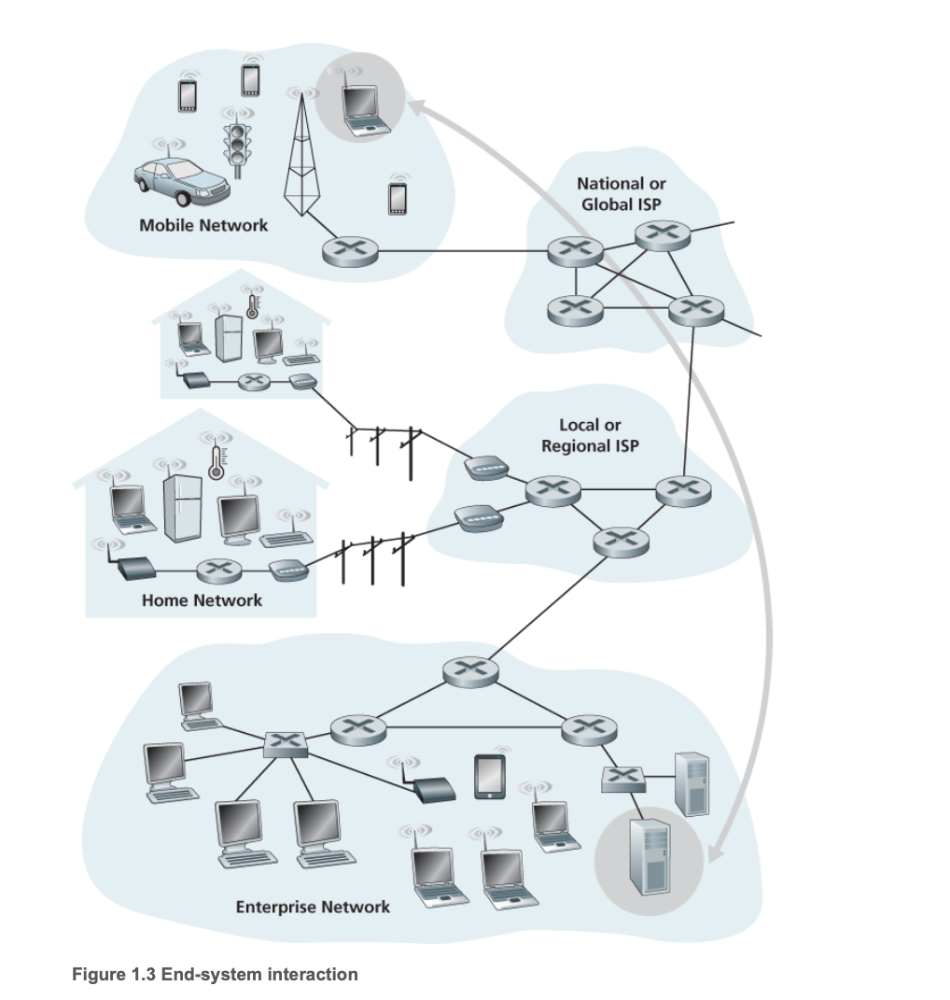

##	Progress
###	0 / 368

# Chapter 1 Computer Network and the Internet

## 1.1 What Is the Internet?

### 1.1.1 A Nuts-and-Bolts Description

End systems are connected together by a network of communication links and packet switches.

A packet switch takes a packet arriving on one of its incoming communication links and forwards that
packet on one of its outgoing communication links. Packet switches come in many shapes and flavors,
but the two most prominent types in today’s Internet are **routers** and **link-layer switches**.

End systems access the Internet through **Internet Service Providers (ISPs)**

End systems, packet switches, and other pieces of the Internet run protocols that control the sending
and receiving of information within the Internet. The **Transmission Control Protocol (TCP)** and the
**Internet Protocol (IP)** are two of the most important protocols in the Internet.

The Internet’s principal protocols are collectively known as **TCP/IP**.

### 1.1.2 A Services Description

The applications are said to be **distributed applications**, since they involve multiple end
systems that exchange data with each other. Importantly, Internet applications run on end systems—
they do not run in the packet switches in the network core.

End systems attached to the Internet provide a **socket interface** that specifies how a program running
on one end system asks the Internet infrastructure to deliver data to a specific destination program
running on another end system.

### 1.1.3 What is protocol?

A protocol defines the format and the order of messages exchanged between two or more
communicating entities, as well as the actions taken on the transmission and/or receipt of a message
or other event.

#### Figure 1.2 A human protocol and a computer network protocol

## 1.2 The Network Edge

#### Figure 1.3 End-system interaction

**End systems** are also referred to as hosts because they host (that is, run) application programs such as
a Web browser program, a Web server program, an e-mail client program, or an e-mail server program.
Throughout this book we will use the terms hosts and end systems interchangeably; that is, host = end system.

Hosts are sometimes further divided into two categories: **clients** and **servers**.

Today, most of the servers from which we receive search results, e-mail, Web pages, and videos reside in large **data centers**.

### 1.2.1 Access Networks

# Chapter 1: Review Questions

## Section 1.1

### R1. What is the difference between a host and an end system? List several different types of end systems. Is a Web server an end system?

There are no differences between host and end systems. Host is a subclass of end system.

Some Examples of end systems are: traditional desktop PCs, Linux, workstations, laptops, smartphones, tablets, TVs, gaming consoles, thermostats, home security systems, home appliances, watches, eye glasses, cars, traffic control systems and more.

Web server **is** an end system. Since web server has no other means to connect to the local network. Web server, just like other end systems, should commmunicate through network with other members.

### R2. The word protocol is often used to describe diplomatic relations. How does Wikipedia describe diplomatic protocol?

A protocol is a rule which describes how an activity should be performed.

### R3. Why are standards important for protocols?

All members of network should implement standard of protocol in order to maintain error-prone and efficient communication with other members.

## Section 1.2

### R4. List six access technologies. Classify each one as home access, enterprise access, or wide-area wireless access.

1. DSL (digital subscriber line): home access
2. Cable Internet Access: home access
3. FTTH (fiber to the home): home access
4. Wi-Fi: home and enterprise access
5. Ethernet: home and enterprise access
6. Cellular Networks 3G, 4G (LTE, Long-Term Evolution) or 5G: wide-area wireless access

### R5. Is HFC transmission rate dedicated or shared among users? Are collisions possible in a downstream HFC channel? Why or why not?

HFC (Hybrid Fiber-Coaxial) is shared among users. This means that the available bandwidth is collectively utilized by all connected subscribers, rather than each user having a dedicated portion. Downstream channel (Headend to Users) collisions are impossible due to data originates from one source.

### R6. List the available residential access technologies in your city. For each type of access, provide the advertised downstream rate, upstream rate, and monthly price.

### R7. What is the transmission rate of Ethernet LANs?

### R8. What are some of the physical media that Ethernet can run over?

### R9. Dial-up modems, HFC, DSL and FTTH are all used for residential access. For each of these access technologies, provide a range of ­transmission rates and comment on whether the transmission rate is shared or dedicated.

### R10. Describe the most popular wireless Internet access technologies today. ­Compare andcontrast them.

## Section 1.3

### R11. Suppose there is exactly one packet switch between a sending host and a receiving host. The transmission rates between the sending host and the switch and between the switch and the receiving host are R1 and R2 , respectively. Assuming that the switch uses store-and-forward packet switching, what is the total end-to-end delay to send a packet of length L? (Ignore queuing, propagation delay, and processing delay.)

### R12. What advantage does a circuit-switched network have over a packet-switched network? What advantages does TDM have over FDM in a circuit-switched network?

### R13. Suppose users share a 2 Mbps link. Also suppose each user transmits continuously at 1 Mbps when transmitting, but each user transmits only 20 percent of the time. (See the discussion of statistical multiplexing in Section 1.3 .)

#### a. When circuit switching is used, how many users can be supported?

#### b.  For the remainder of this problem, suppose packet switching is used. Why will there be essentially no queuing delay before the link if two or fewer users transmit at the same time? Why will there be a queuing delay if three users transmit at the same time?

#### c. Find the probability that a given user is transmitting.

#### d. Suppose now there are three users. Find the probability that at any given time, all three users are transmitting simultaneously. Find the fraction of time during which the queue grows.

### R14. Why will two ISPs at the same level of the hierarchy often peer with each other? How does an IXP earn money?

### R15. Some content providers have created their own networks. Describe Google’s network. What motivates content providers to create these networks?

## Section 1.4

### R16. Consider sending a packet from a source host to a destination host over a fixed route. List the delay components in the end-to-end delay. Which of these delays are constant and which are variable?

### R17. Visit the Transmission Versus Propagation Delay applet at the companion Web site. Among the rates, propagation delay, and packet sizes available, find a combination for which the sender finishes transmitting before the first bit of the packet reaches the receiver. Find another combination for which the first bit of the packet reaches the receiver before the sender finishes transmitting.

### R18. How long does it take a packet of length 1,000 bytes to propagate over a link of distance 2,500 km, propagation speed 2.5⋅108 m/s, and transmission rate 2 Mbps? More generally, how long does it take a packet of length L to propagate over a link of distance d, propagation speed s, and transmission rate R bps? Does this delay depend on packet length? Does this delay depend on transmission rate?

### R19. Suppose Host A wants to send a large file to Host B. The path from Host A to Host B has three links, of rates R1=500 kbps, R2=2 Mbps, and R3=1 Mbps.
#### a. Assuming no other traffic in the network, what is the throughput for the file transfer?
#### b. Suppose the file is 4 million bytes. Dividing the file size by the throughput, roughly how long will it take to transfer the file to Host B?
#### c. Repeat (a) and (b), but now with R2 reduced to 100 kbps.

### R20. Suppose end system A wants to send a large file to end system B. At a very high level, describe how end system A creates packets from the file. When one of these packets arrives to a router, what information in the packet does the router use to determine the link onto which the packet is forwarded? Why is packet switching in the Internet analogous to driving from one city to another and asking directions along the way?

### R21. Visit the Queuing and Loss applet at the companion Web site. What is the maximum emission rate and the minimum transmission rate? With those rates, what is the traffic intensity? Run the applet with these rates and determine how long it takes for packet loss to occur. Then repeat the experiment a second time and determine again how long it takes for packet loss to occur. Are the values different? Why or why not?

## Section 1.5

### R22. List five tasks that a layer can perform. Is it possible that one (or more) of these tasks could be performed by two (or more) layers?

### R23. What are the five layers in the Internet protocol stack? What are the principal responsibilities of each of these layers?

### R24. What is an application-layer message? A transport-layer segment? A network-layer datagram? A link-layer frame?

### R25. Which layers in the Internet protocol stack does a router process? Which layers does a link-layer switch process? Which layers does a host process?

## Section 1.6

### R26. What is the difference between a virus and a worm?

### R27. Describe how a botnet can be created and how it can be used for a DDoS attack.

### R28. Suppose Alice and Bob are sending packets to each other over a computer network. Suppose Trudy positions herself in the network so that she can capture all the packets sent by Alice and send whatever she wants to Bob; she can also capture all the packets sent by Bob and send whatever she wants to Alice. List some of the malicious things Trudy can do from this position.

# Chapter 1: Problems

