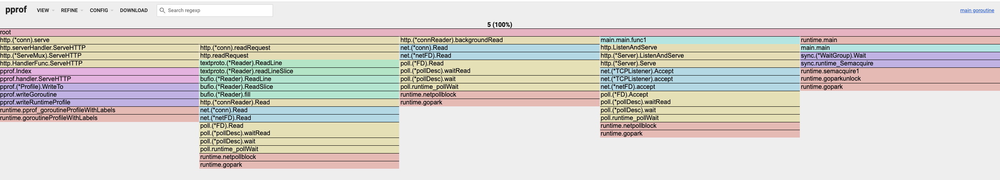
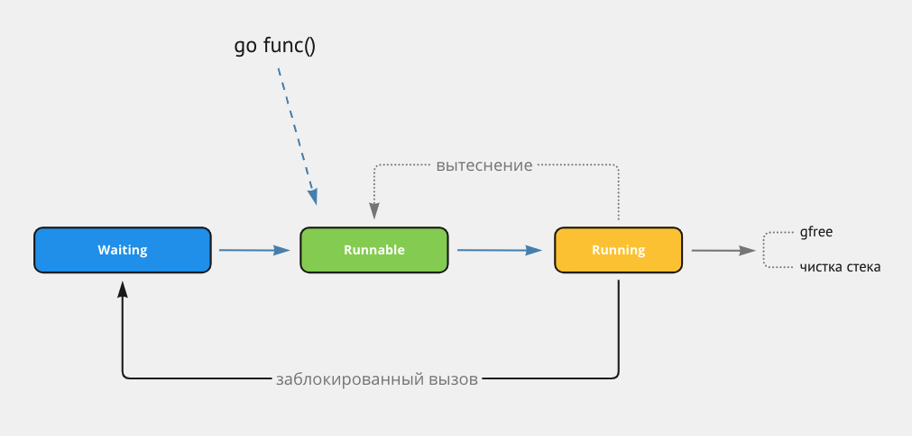
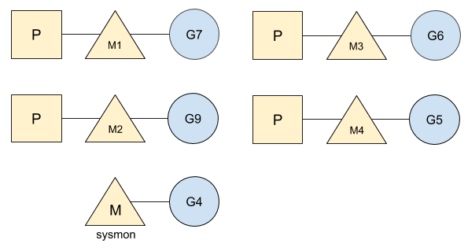
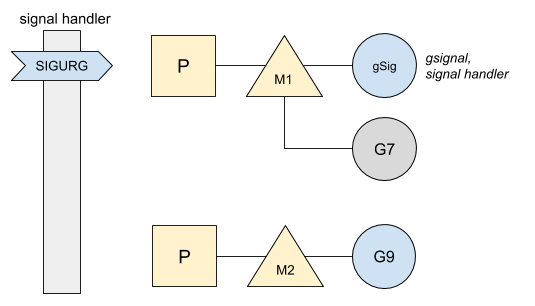

## Progress
### 14 / 27

# Table of contents
- [Table of contents](#table-of-contents)
- [Slice](#slice)
	- [Slices](#slices)
	- [Slice tricks](#slice-tricks)
- [Interface](#interface)
	- [Interface internals](#interface-internals)
		- [`iface` vs `eface`](#iface-vs-eface)
			- [`Type` structure](#type-structure)
		- [Comparing interface and `nil`](#comparing-interface-and-nil)
		- [Compiler determines whether struct implements interface](#compiler-determines-whether-struct-implements-interface)
		- [How interface is being built https://studygolang.com/articles/28873](#how-interface-is-being-built-httpsstudygolangcomarticles28873)
		- [Polymorphism and how much it costs](#polymorphism-and-how-much-it-costs)
		- [Why do `T` and `*T` have different method sets?](#why-do-t-and-t-have-different-method-sets)
				- [How methods can be called on various receivers](#how-methods-can-be-called-on-various-receivers)
				- [Interfaces](#interfaces)
				- [Why such implementation?](#why-such-implementation)
- [Golang address operator](#golang-address-operator)
- [Regular `for range` loop](#regular-for-range-loop)
		- [What is output of this program and why?](#what-is-output-of-this-program-and-why)
- [`error`, `panic` and `os.Exit()`](#error-panic-and-osexit)
	- [`panic` – either unexpected error that one could recover from or programmer error](#panic--either-unexpected-error-that-one-could-recover-from-or-programmer-error)
		- [unexpected error](#unexpected-error)
		- [programmer error](#programmer-error)
	- [os.Exit() – immediate exit](#osexit--immediate-exit)
	- [`error` – error that should be handled](#error--error-that-should-be-handled)
- [Embedding in Go](#embedding-in-go)
	- [structs in structs](#structs-in-structs)
		- [Example: `sync.Mutex`](#example-syncmutex)
		- [Example: `elf.FileHeader`](#example-elffileheader)
		- [Example: method promotion](#example-method-promotion)
	- [interfaces in interfaces](#interfaces-in-interfaces)
	- [interfaces in structs](#interfaces-in-structs)
		- [Example: interface wrapper](#example-interface-wrapper)
		- [Example: `context.WithValue`](#example-contextwithvalue)
- [Defer statement](#defer-statement)
	- [General information](#general-information)
		- [Example 1](#example-1)
		- [Example 2](#example-2)
		- [Example 3](#example-3)
	- [Performance implications](#performance-implications)
- [Map](#map)
	- [As of Go 1.23](#as-of-go-123)
		- [Random access of elements](#random-access-of-elements)
			- [range over map](#range-over-map)
			- [fmt.Print](#fmtprint)
		- [Can't take the address of element](#cant-take-the-address-of-element)
		- [Evacuation](#evacuation)
- [Memory](#memory)
	- [Memory mental layout](#memory-mental-layout)
- [Escape analysis](#escape-analysis)
	- [Basics](#basics)
		- [1. Function returns pointer](#1-function-returns-pointer)
			- [Example 1.1 – pointer return](#example-11--pointer-return)
			- [Example 1.2 – underlying pointer return](#example-12--underlying-pointer-return)
			- [Example 1.3 – underlying pointer return](#example-13--underlying-pointer-return)
			- [Example 1.4 – embedding interface in struct](#example-14--embedding-interface-in-struct)
		- [2. Argument passed as interface{}](#2-argument-passed-as-interface)
			- [Example 2.1](#example-21)
			- [Example 2.2](#example-22)
		- [3. Size of argument exceeds stack memory limit](#3-size-of-argument-exceeds-stack-memory-limit)
			- [Example 3.1](#example-31)
		- [4. End size is unknown](#4-end-size-is-unknown)
			- [4.1 io operations](#41-io-operations)
		- [When escape analysis is executed?](#when-escape-analysis-is-executed)
		- [Some takeaways regarding compiler optimizations, taken from William Kennedy](#some-takeaways-regarding-compiler-optimizations-taken-from-william-kennedy)
		- [Final words](#final-words)
	- [Semantic Guidelines](#semantic-guidelines)
			- [Semantic 1: Built in types. Numeric, textual and boolean data.](#semantic-1-built-in-types-numeric-textual-and-boolean-data)
			- [Semantic 2: Reference types. Slice, map, interface, function and channel.](#semantic-2-reference-types-slice-map-interface-function-and-channel)
			- [Semantic 3: User defined types.](#semantic-3-user-defined-types)
				- [Example 1: Value semantic](#example-1-value-semantic)
				- [Example 2: Pointer semantic](#example-2-pointer-semantic)
	- [Conclusion](#conclusion)
- [Garbage collector](#garbage-collector)
	- [Concept](#concept)
	- [Algorithm](#algorithm)
	- [Mutator and write barrier](#mutator-and-write-barrier)
	- [Pacer](#pacer)
	- [GC full cycle](#gc-full-cycle)
	- [Rule of thumbs](#rule-of-thumbs)
	- [Optimizations](#optimizations)
- [Memory leaks](#memory-leaks)
	- [Never start a goroutine without kn](#never-start-a-goroutine-without-kn)
	- [Goroutine leaks](#goroutine-leaks)
	- [Unbounded resource creation](#unbounded-resource-creation)
		- [Long lived references](#long-lived-references)
		- [Deferred code in loop](#deferred-code-in-loop)
- [Goroutine leak](#goroutine-leak)
	- [What is goroutine leak?](#what-is-goroutine-leak)
	- [Monitoring with runtime](#monitoring-with-runtime)
	- [Profiling with `pprof`](#profiling-with-pprof)
	- [Leaking scenarios](#leaking-scenarios)
		- [Scenario 1: Blocked on channel](#scenario-1-blocked-on-channel)
			- [Problem](#problem)
			- [Solution](#solution)
		- [Scenario 2: Forgotten Goroutine](#scenario-2-forgotten-goroutine)
			- [Problem](#problem-1)
		- [Scenario 3: Leaking in a loop](#scenario-3-leaking-in-a-loop)
			- [Problem](#problem-2)
			- [Solution](#solution-1)
		- [Key takeaways](#key-takeaways)
- [Goroutine leak detector](#goroutine-leak-detector)
- [Go Scheduler](#go-scheduler)
	- [Part I; OS Scheduler](#part-i-os-scheduler)
		- [Thread States](#thread-states)
			- [Waiting](#waiting)
			- [Runnable](#runnable)
			- [Executing](#executing)
	- [Types of work](#types-of-work)
		- [CPU-Bound](#cpu-bound)
		- [IO-Bound](#io-bound)
	- [Context switch](#context-switch)
		- [IO-Bound work oriented program](#io-bound-work-oriented-program)
		- [CPU-Bound work oriented program](#cpu-bound-work-oriented-program)
	- [Part II; Go Scheduler](#part-ii-go-scheduler)
		- [Intruduction](#intruduction)
		- [OS Scheduler](#os-scheduler)
		- [Go Scheduler](#go-scheduler-1)
			- [Preemptive scheduling](#preemptive-scheduling)
			- [Cooperative scheduling](#cooperative-scheduling)
			- [Key takeaways](#key-takeaways-1)
		- [Goroutine States](#goroutine-states)
		- [Context switching](#context-switching)
		- [Network Calls](#network-calls)
		- [Synchronous System Calls](#synchronous-system-calls)
		- [Work stealing algorithm](#work-stealing-algorithm)
		- [Network Poller](#network-poller)
		- [Practical example](#practical-example)
			- [C program](#c-program)
			- [Go program](#go-program)
	- [Part III; Concurrency](#part-iii-concurrency)
		- [Workloads](#workloads)
			- [CPU-Bound](#cpu-bound-1)
			- [IO-Bound](#io-bound-1)
			- [Conclusion](#conclusion-1)
		- [Test cases](#test-cases)
			- [Adding numbers](#adding-numbers)
			- [Sorting](#sorting)
			- [Reading files](#reading-files)
	- [Context switch](#context-switch-1)
		- [Scenarios](#scenarios)
			- [Scenario 1: Blocking operations](#scenario-1-blocking-operations)
			- [Scenario 2: System Calls](#scenario-2-system-calls)
			- [Scenario 3: Channel Operations](#scenario-3-channel-operations)
			- [Scenario 4: Sleep or Yield](#scenario-4-sleep-or-yield)
		- [Context switch steps](#context-switch-steps)
		- [Sysmon](#sysmon)
			- [Responsibility](#responsibility)
			- [Pace](#pace)
			- [Asynchronous Preemption](#asynchronous-preemption)


# Slice
## Slices

https://go.dev/blog/slices
A slice is a data structure describing a contiguous section of an array stored separately from the slice variable itself. A slice is not an array. A slice describes a piece of an array.

```go
func main() {
	a := make([]int, 3)
	a[2] = 3

	b := a[2:3]

	fmt.Println(a)
	fmt.Println(b)

	a[2] = 42

	fmt.Println(a)
	fmt.Println(b)
}
```
```
[0 0 3]
[3]
[0 0 42]
[42]
```

You’ll often hear experienced Go programmers talk about the “slice header” because that really is what’s stored in a slice variable. For instance, when you call a function that takes a slice as an argument, such as `foo`, that header is what gets passed to the function. In this call,
the slice argument that is passed to the `foo` function is, in fact, a “slice header”.
```go
func foo(slice []int) {
	slice[0] = 42
}

func main() {
	slice := make([]int, 1)
	fmt.Println(slice)
	foo(slice)
	fmt.Println(slice)
}
```
```
[0]
[42]
```


Even though the slice header is passed by value, the header includes a pointer to elements of an array, so both the original slice header and the copy of the header passed to the function describe the same array. Therefore, when the function returns, the modified elements can be seen through the original slice variable.
```go
func foo(slice []int) {
	for i := range slice {
		slice[i] += 2
	}
}

func main() {
	var buffer [10]int
	slice := buffer[5:10]
	for i := 0; i < len(slice); i++ {
		slice[i] = i
	}
	fmt.Println("before", slice, buffer)
	foo(slice)
	fmt.Println("after", slice, buffer)
}
```
```
before [0 1 2 3 4] [0 0 0 0 0 0 1 2 3 4]
after [2 3 4 5 6] [0 0 0 0 0 2 3 4 5 6]
```

Here we see that the contents of a slice argument can be modified by a function, but its *header cannot*. The length stored in the slice variable is not modified by the call to the function, since the function is passed a copy of the slice header, not the original.
```go
func foo(slice []int) []int {
	slice = slice[0 : len(slice)-1]
	slice[0] = 42
	return slice
}

func main() {
	slice := make([]int, 5)

	fmt.Println("Before: len(slice) =", len(slice))
	newSlice := foo(slice)
	fmt.Println("After:  len(slice) =", len(slice))
	fmt.Println("After:  len(newSlice) =", len(newSlice))
}
```
```
Before: len(slice) = 5
After:  len(slice) = 5
After:  len(newSlice) = 4
```

```go
func PtrSubtractOneFromLength(slicePtr *[]int) {
	*slicePtr = (*slicePtr)[0 : len(*slicePtr)-1]

	// same as above
	// slice := *slicePtr
	// *slicePtr = slice[0 : len(slice)-1]
}

func main() {
	slice := make([]int, 5)
	fmt.Println("Before: len(slice) =", len(slice))
	PtrSubtractOneFromLength(&slice)
	fmt.Println("After:  len(slice) =", len(slice))
}
```
```
Before: len(slice) = 5
After:  len(slice) = 4
```

```go
func main() {
	var slice []int //          -- len: 0, cap: 0, slice == nil: true, sliceHeader: &{0 0 0}
	// slice := []int(nil)      -- len: 0, cap: 0, slice == nil: true, sliceHeader: &{0 0 0}
	// slice := []int{}         -- len: 0, cap: 0, slice == nil: false, sliceHeader: &{4302501024 0 0}
	// slice := make([]int, 0)  -- len: 0, cap: 0, slice == nil: false, sliceHeader: &{4302501024 0 0}

	sliceHeader := (*reflect.SliceHeader)(unsafe.Pointer(&slice))

	fmt.Printf(
		"len: %d, cap: %d, slice == nil: %t, sliceHeader: %v\n",
		len(slice), cap(slice), slice == nil, sliceHeader,
	)
}
```

## Slice tricks
https://go.dev/wiki/SliceTricks

```go
func main() {
	a := []int{1, 2, 3}
	b := []int{7, 8, 9, 10}

	// append vector
	// a: [1 2 3]
	// b: [7 8 9 10 1 2 3]
	b = append(b, a...)

	// copy
	// a: [1, 2, 3]
	// c: [1, 2, 3]
	c := make([]int, len(a))
	copy(c, a)

	// cut
	// b: [7 8 1 2 3]
	b = append(b[:2], b[4:]...)

	// delete
	// b: [7 8 2 3]
	i := 2
	b = append(b[:i], b[i+1:]...)
}
```

Leak-aware cut mitigates memory leaks as values are still referenced in previous slice.
```go
func main() {
	a := []*int64{
		PointerToInt64(1),
		PointerToInt64(2),
		PointerToInt64(3),
		PointerToInt64(4),
		PointerToInt64(5),
	}

	// leak-aware cut
	// [1, 2, 5]
	i, j := 2, 4
	copy(a[i:], a[j:])
	for k, n := len(a)-j+i, len(a); k < n; k++ {
		a[k] = nil
	}
	a = a[:len(a)-j+i]

}

func PointerToInt64(i int64) *int64 {
	return &i
}
```

Other tricks
```go
func main() {
	a := []int{1, 2, 3, 4, 5}
	b := []int{42, 21}

	// Expand
	// Insert n elements at position i
	// a: [1 2 3 4 5 0]
	i, n := len(a), 1
	a = append(a[:i], append(make([]int, n), a[i:]...)...)

	// Extend
	// Append n elements
	// a: [1 2 3 4 5 0 0]
	a = append(a, make([]int, n)...)

	// Extend capacity
	// Make sure there is space for next n elements
	// len, cap = 7, 10 --> len, cap = 7, 12
	n = 5
	a = append(make([]int, 0, len(a)+n), a...)

	// Insert
	// b: [97 42 21]
	i = 0
	b = append(b, 0)
	copy(b[i+1:], b[i:])
	b[i] = 97

	// In-place filtering
	// This tricks uses the fact that a slice shares array and capacity as the original,
	// so the storage is reused for filtered slice.
	c := b[:0]
	for _, x := range b {
		if x < 50 {
			c = append(c, x)
		}
	}
}
```

# Interface
## Interface internals
https://golang.design/go-questions/interface/iface-eface/

### `iface` vs `eface`

`iface` и `eface` are basic structures which describe interfaces in Golang. `iface` includes methods and `eface` describes empty interface which does not include any methods.

`iface` includes two pointers: `tab` pointing to `itab` structure which describes interface type and data pointing to concrete value of interface (usually stored on heap).
```go
type itab struct { // 40 bytes on a 64bit arch
    inter *interfacetype // wrapper around _type with some extra information
    _type *_type         // internal representation of go type within runtime
    hash  uint32         // copy of _type.hash. Used for type switches.
    _     [4]byte
    fun   [1]uintptr     // multiple method addresses are stored here; use pointer arithmetics to iterate
}
```

<!-- func FindDigits(filename string) []byte {
    b, _ := ioutil.ReadFile(filename)
    dst := digitRegexp(b)
    result := copy(dst, source)
    return dst
} -->

```go
type interfaceType = abi.InterfaceType

type InterfaceType struct {
	Type
	PkgPath Name      // import path
	Methods []Imethod // sorted by hash
}
```

Interface with methods
```go
type iface struct {
	tab  *itab
	data unsafe.Pointer
}
```

Empty interface
```go
type eface struct {
	_type *_type
	data  unsafe.Pointer
}
````

#### `Type` structure
```go
type _type = abi.Type

type Type struct {
    Size_       uintptr
    PtrBytes    uintptr // number of (prefix) bytes in the type that can contain pointers
    Hash        uint32  // hash of type; avoids computation in hash tables
    TFlag       TFlag   // extra type information flags
    Align_      uint8   // alignment of variable with this type
    FieldAlign_ uint8   // alignment of struct field with this type
    Kind_       uint8   // enumeration for C
    // function for comparing objects of this type
    // (ptr to object A, ptr to object B) -> ==?
    Equal func(unsafe.Pointer, unsafe.Pointer) bool
    // GCData stores the GC type data for the garbage collector.
    // If the KindGCProg bit is set in kind, GCData is a GC program.
    // Otherwise it is a ptrmask bitmap. See mbitmap.go for details.
    GCData    *byte
    Str       NameOff // string form
    PtrToThis TypeOff // type for pointer to this type, may be zero
}
```

Some of Golang first class citizens are described by embedded `Type` structure
```go
type ChanType struct {
	Type
	Elem *Type
	Dir  ChanDir
}

type StructType struct {
    Type
    PkgPath Name
    Fields  []StructField
}

type SliceType struct {
    Type
    Elem *Type // slice element type
}
```

### Comparing interface and `nil`
From previous section we found out that interface consists of `tab` holding type related information and `data` holding data of implemented struct

Interface considered `nil` if and only if `tab` **and** `data` are both `nil`
```go
type Inter interface {
	foo()
}

type Strct struct {
	name string
}

func (g Strct) foo() {
	print(g.name)
}

func main() {
	var inter Inter
	x := inter == nil
	fmt.Printf("inter: type is %v; value is %+v\n", reflect.TypeOf(inter), inter)
	println(x)

	var strct *Strct

	inter = strct
	y := inter == nil
	fmt.Printf("inter: type is %v; value is %+v\n", reflect.TypeOf(inter), inter)
	println(y)

	strct1 := &Strct{name: "some struct"}
	inter = strct1
	z := inter == nil
	fmt.Printf("inter: type is %v; value is %+v\n", reflect.TypeOf(inter), inter)
	println(z)
}
```
```
inter: type is <nil>; value is <nil>
true
inter: type is *main.Strct; value is <nil>
false
inter: type is *main.Strct; value is &{name:some struct}
false
```

Another example regarding comparing interface and `nil`
```go
package main

import (
	"fmt"
	"reflect"
)

type MyError struct{}

func (i MyError) Error() string {
	return "MyError"
}

func main() {
	var err1 error = Process1()
	fmt.Printf("err1: type is %v; value is %+v\n", reflect.TypeOf(err1), err1)
	println(err1 == nil) // true because both type and data of err1 is nil

	var err2 error = Process2()
	fmt.Printf("err2: type is %v; value is %+v\n", reflect.TypeOf(err2), err2)
	println(err2 == nil) // false type of err2 is not nil
}

func Process1() error {
	return nil
}

func Process2() *MyError {
	var err *MyError = nil
	return err
}
```
```
err1: type is *main.MyError; value is <nil>
false
err2: type is *main.MyError; value is <nil>
true
```

There is also a way to print`iface` addresses of tab and data
```go
// we know that underlying interface type consists of two pointers,
// so we can imitate underlying structure with custom one
type iface struct {
    itab uintptr
    data uintptr
}

func main() {
    var a interface{} = nil
    
    var b interface{} = (*int)(nil)
    
    x := 5
    var c interface{} = (*int)(&x)
    
    ia := *(*iface)(unsafe.Pointer(&a))
    ib := *(*iface)(unsafe.Pointer(&b))
    ic := *(*iface)(unsafe.Pointer(&c))
    
    fmt.Printf("%+v\n%+v\n%+v\n", ia, ib, ic)
}
```
```
{itab:0 data:0}
{itab:4363494528 data:0}
{itab:4363494528 data:1374390603392}
```

We also can see what `data` pointer (uintptr) holds. Spoiler: it's interface implementing structure.
```go
package main

type Strct struct {
	i int
	s string
}

type Inter interface {
	Foo()
}

func (s Strct) Foo() {
}

type iface struct {
	itab uintptr
	data uintptr
}

func main() {

	x := Strct{
		i: 42,
		s: "some random text",
	}
	var a Inter = (*Strct)(&x)

	ia := *(*iface)(unsafe.Pointer(&a))
	da := *(*Strct)(unsafe.Pointer(ia.data))
	fmt.Printf("%+v\n", ia)
	fmt.Printf("%+v\n", da)
}
```
```
{itab:4363752104 data:1374390628048}
{i:42 s:some random text}
```

### Compiler determines whether struct implements interface
In some libraries you might have seen the following kind of statement
```go
var _ io.Writer = (*myWriter)(nil)
```
It serves as static check for compiler to decide whether struct implements interface
```go
package main

// Check whether Strct implements Inter
var _ Inter = (*Strct)(nil)
var _ Inter = Strct{}

type Inter interface {
	Foo()
}

type Strct struct {
}

//func (w Strct) Foo() {
//}

func main() {
}
```
```
main.go:4:15: cannot use (*Strct)(nil) (value of type *Strct) as Inter value in variable declaration: *Strct does not implement Inter (missing method Foo)
main.go:5:15: cannot use Strct{} (value of type Strct) as Inter value in variable declaration: Strct does not implement Inter (missing method Foo)
```
When compiler performs type checking phase it reports unimplemented interface

### How interface is being built https://studygolang.com/articles/28873
Let's take a look at the following code
```go
package main

type InterFoo interface {
	Foo() int32
}

type Strct1 struct {
	StrctValue int32
}

//go:noinline
func (s Strct1) Foo() int32 {
	return s.StrctValue
}

func main() {
	// It is the only way to make compiler not optimize out interface creation,
	// so we initialize `m` and only then assign struct to it
	var m InterFoo
	m = Strct1{StrctValue: 6742}

	// This call just makes sure that the interface is actually used.
	// Without this call, the linker would see that the interface defined above
	// is in fact never used, and thus would optimize it out of the final
	// executable.
	// As of Go 1.23 I see tendency for compiler optimizing it out regardless of call.
	// So you need to disable compiler optimizations in order to see what's going on under the hood.
	someFooValue := m.Foo()

	println(someFooValue)
}
```

Execute `go tool compile -S -N -l main.go > compiler.log`
It produces the following compiler output. Here we can see `itab` dump.
```
	0x001c 00028 (/Users/ayionov/Desktop/cs/language/go/go_manual/main.go:20)	MOVW	ZR, main..autotmp_2-28(SP)
	0x0020 00032 (/Users/ayionov/Desktop/cs/language/go/go_manual/main.go:20)	MOVD	$6742, R1
	0x0024 00036 (/Users/ayionov/Desktop/cs/language/go/go_manual/main.go:20)	MOVW	R1, main..autotmp_2-28(SP)
	0x0028 00040 (/Users/ayionov/Desktop/cs/language/go/go_manual/main.go:20)	MOVW	R1, main..autotmp_3-32(SP)
	0x002c 00044 (/Users/ayionov/Desktop/cs/language/go/go_manual/main.go:20)	MOVD	$main..autotmp_3-32(SP), R1
	0x0030 00048 (/Users/ayionov/Desktop/cs/language/go/go_manual/main.go:20)	PCDATA	$0, $-2
	0x0030 00048 (/Users/ayionov/Desktop/cs/language/go/go_manual/main.go:20)	MOVB	(R1), R27
	0x0034 00052 (/Users/ayionov/Desktop/cs/language/go/go_manual/main.go:20)	PCDATA	$0, $-1
	0x0034 00052 (/Users/ayionov/Desktop/cs/language/go/go_manual/main.go:20)	MOVWU	(R1), R0
	0x0038 00056 (/Users/ayionov/Desktop/cs/language/go/go_manual/main.go:20)	MOVW	R0, main..autotmp_4-36(SP)
	0x003c 00060 (/Users/ayionov/Desktop/cs/language/go/go_manual/main.go:20)	PCDATA	$1, $0
	0x003c 00060 (/Users/ayionov/Desktop/cs/language/go/go_manual/main.go:20)	CALL	runtime.convT32(SB)
	0x0040 00064 (/Users/ayionov/Desktop/cs/language/go/go_manual/main.go:20)	MOVD	R0, main..autotmp_5-8(SP)
	0x0044 00068 (/Users/ayionov/Desktop/cs/language/go/go_manual/main.go:20)	MOVD	$go:itab.<unlinkable>.Strct1,<unlinkable>.InterFoo(SB), R1
	0x004c 00076 (/Users/ayionov/Desktop/cs/language/go/go_manual/main.go:20)	MOVD	R1, main.m-24(SP)
	0x0050 00080 (/Users/ayionov/Desktop/cs/language/go/go_manual/main.go:20)	MOVD	R0, main.m-16(SP)
```

It will be used by linker later
```
go:itab.<unlinkable>.Strct1,<unlinkable>.InterFoo SRODATA dupok size=32
	0x0000 00 00 00 00 00 00 00 00 00 00 00 00 00 00 00 00  ................
	0x0010 ed 1c 7f 68 00 00 00 00 00 00 00 00 00 00 00 00  ...h............
	rel 0+8 t=R_ADDR type:<unlinkable>.InterFoo+0
	rel 8+8 t=R_ADDR type:<unlinkable>.Strct1+0
	rel 24+8 t=RelocType(-32767) <unlinkable>.(*Strct1).Foo+0
```

Only hash is set at compile time
```go
type itab struct {
    inter *interfacetype // offset 0x00 ($00) | 00 00 00 00 00 00 00 00
    _type *_type         // offset 0x08 ($08) | 00 00 00 00 00 00 00 00
    hash  uint32         // offset 0x16 ($16) | ed 1c 7f 68
    _     [4]byte        // offset 0x18 ($20) | 00 00 00 00
    fun   [1]uintptr     // offset 0x20 ($24) | 00 00 00 00 00 00 00 00
}
```

We also see that `itab` structure corresponds to linker offset
```
	rel 0+8 t=R_ADDR type:<unlinkable>.InterFoo+0             offset to `inter *interfacetype`
	rel 8+8 t=R_ADDR type:<unlinkable>.Strct1+0               offset to `_type *_type`
	rel 24+8 t=RelocType(-32767) <unlinkable>.(*Strct1).Foo+0 offset to `fun   [1]uintptr`
```
When linker will finish its job, the `itab` will be complete at this point

Generate an ELF file using `GOOS=linux GOARCH=arm64 go build -o main.bin -gcflags='-N -l' main.go `
I'll use online tool to read ELF file in order to find virtual address of complete `InterFoo`'s `itab` (http://www.sunshine2k.de/coding/javascript/onlineelfviewer/onlineelfviewer.html)
```
Nr             Value               Size                Info (Binding|Type) Other          Shndx          Name
1562           0x00000000000AF298  0x0000000000000020  GLOBAL | OBJECT     DEFAULT        0x0002         go:itab.main.Strct1,main.InterFoo
```

The only thing is needed is to find .rodata offset. We can find it in section header tables
```
Nr             Name                Type           Address             Offset              Size                Link           Info           AddrAlign           EntSize             Flags
2              .rodata             SHT_PROGBITS   0x0000000000080000  0x0000000000070000  0x0000000000030262  0x00000000     0x00000000     0x0000000000000020  0x0000000000000000  Alloc
```

We have everything we need:
Section offset   is 0x0000000000070000 = 458752
Section vma      is 0x0000000000080000 = 524288
Itab symbol vma  is 0x00000000000AF298 = 717464
Itab symbol size is 0x0000000000000020 = 32

In order to find complete `itab`, its symbol offset we'll use the formula
`symbol offset = symbol vma - section vma + section offset`
Transforms to
`717464 - 524288 + 458752 = 651928`

Upon execution `dd if=main.bin of=/dev/stdout bs=1 count=32 skip=651928 2>/dev/null | hexdump -C` we'll see complete itab
```
00000000  e0 79 08 00 00 00 00 00  60 92 08 00 00 00 00 00  |.y......`.......|
00000010  ed 1c 7f 68 00 00 00 00  40 71 07 00 00 00 00 00  |...h....@q......|
00000020
```

```go
type itab struct {
    inter *interfacetype // offset 0x00 ($00) | e0 79 08 00 00 00 00 00
    _type *_type         // offset 0x08 ($08) | 60 92 08 00 00 00 00 00
    hash  uint32         // offset 0x16 ($16) | ed 1c 7f 68
    _     [4]byte        // offset 0x18 ($20) | 00 00 00 00
    fun   [1]uintptr     // offset 0x20 ($24) | 40 71 07 00 00 00 00 00
}
```

### Polymorphism and how much it costs
```go
package main

type InterFoo interface {
	Foo(int32) int32
	Bar(int64) int64
	Meow(int16) int16
}

type Strct1 struct {
	StrctValue int32
}

//go:noinline
func (s Strct1) Foo(fooValue int32) int32 {
	return s.StrctValue + fooValue
}

//go:noinline
func (s Strct1) Bar(barValue int64) int64 {
	return int64(s.StrctValue) + barValue
}

//go:noinline
func (s Strct1) Meow(meowValue int16) int16 {
	return int16(s.StrctValue) + meowValue
}

func main() {
	var m InterFoo
	m = Strct1{StrctValue: 6742}

	someFooValue := m.Foo(42)
	someBarValue := m.Bar(788)
	someMeowValue := m.Meow(9128)

	println(someFooValue, someBarValue, someMeowValue)
}

```

Compiler output for main function
```
main.main STEXT size=224 args=0x0 locals=0x48 funcid=0x0 align=0x0
	0x0000 00000 (/Users/ayionov/Desktop/cs/language/go/go_manual/main.go:28)	TEXT	main.main(SB), ABIInternal, $96-0
	0x0000 00000 (/Users/ayionov/Desktop/cs/language/go/go_manual/main.go:28)	MOVD	16(g), R16
	0x0004 00004 (/Users/ayionov/Desktop/cs/language/go/go_manual/main.go:28)	PCDATA	$0, $-2
	0x0004 00004 (/Users/ayionov/Desktop/cs/language/go/go_manual/main.go:28)	CMP	R16, RSP
	0x0008 00008 (/Users/ayionov/Desktop/cs/language/go/go_manual/main.go:28)	BLS	224
	0x000c 00012 (/Users/ayionov/Desktop/cs/language/go/go_manual/main.go:28)	PCDATA	$0, $-1
	0x000c 00012 (/Users/ayionov/Desktop/cs/language/go/go_manual/main.go:28)	MOVD.W	R30, -96(RSP)
	0x0010 00016 (/Users/ayionov/Desktop/cs/language/go/go_manual/main.go:28)	MOVD	R29, -8(RSP)
	0x0014 00020 (/Users/ayionov/Desktop/cs/language/go/go_manual/main.go:28)	SUB	$8, RSP, R29
	0x0018 00024 (/Users/ayionov/Desktop/cs/language/go/go_manual/main.go:28)	FUNCDATA	$0, gclocals·J5F+7Qw7O7ve2QcWC7DpeQ==(SB)
	0x0018 00024 (/Users/ayionov/Desktop/cs/language/go/go_manual/main.go:28)	FUNCDATA	$1, gclocals·3TP5whGZWqE6ZxU0iS+iBA==(SB)
	0x0018 00024 (/Users/ayionov/Desktop/cs/language/go/go_manual/main.go:29)	STP	(ZR, ZR), main.m-24(SP)
	0x001c 00028 (/Users/ayionov/Desktop/cs/language/go/go_manual/main.go:30)	MOVW	ZR, main..autotmp_4-36(SP)
	0x0020 00032 (/Users/ayionov/Desktop/cs/language/go/go_manual/main.go:30)	MOVD	$6742, R1
	0x0024 00036 (/Users/ayionov/Desktop/cs/language/go/go_manual/main.go:30)	MOVW	R1, main..autotmp_4-36(SP)
	0x0028 00040 (/Users/ayionov/Desktop/cs/language/go/go_manual/main.go:30)	MOVW	R1, main..autotmp_5-40(SP)
	0x002c 00044 (/Users/ayionov/Desktop/cs/language/go/go_manual/main.go:30)	MOVD	$main..autotmp_5-40(SP), R1
	0x0030 00048 (/Users/ayionov/Desktop/cs/language/go/go_manual/main.go:30)	PCDATA	$0, $-2
	0x0030 00048 (/Users/ayionov/Desktop/cs/language/go/go_manual/main.go:30)	MOVB	(R1), R27
	0x0034 00052 (/Users/ayionov/Desktop/cs/language/go/go_manual/main.go:30)	PCDATA	$0, $-1
	0x0034 00052 (/Users/ayionov/Desktop/cs/language/go/go_manual/main.go:30)	MOVWU	(R1), R0
	0x0038 00056 (/Users/ayionov/Desktop/cs/language/go/go_manual/main.go:30)	MOVW	R0, main..autotmp_6-44(SP)
	0x003c 00060 (/Users/ayionov/Desktop/cs/language/go/go_manual/main.go:30)	PCDATA	$1, $0
	0x003c 00060 (/Users/ayionov/Desktop/cs/language/go/go_manual/main.go:30)	CALL	runtime.convT32(SB)
	0x0040 00064 (/Users/ayionov/Desktop/cs/language/go/go_manual/main.go:30)	MOVD	R0, main..autotmp_7-8(SP)
	0x0044 00068 (/Users/ayionov/Desktop/cs/language/go/go_manual/main.go:30)	MOVD	$go:itab.<unlinkable>.Strct1,<unlinkable>.InterFoo(SB), R1
	0x004c 00076 (/Users/ayionov/Desktop/cs/language/go/go_manual/main.go:30)	MOVD	R1, main.m-24(SP)
	0x0050 00080 (/Users/ayionov/Desktop/cs/language/go/go_manual/main.go:30)	MOVD	R0, main.m-16(SP)
	0x0054 00084 (/Users/ayionov/Desktop/cs/language/go/go_manual/main.go:32)	MOVD	$42, R1
	0x0058 00088 (/Users/ayionov/Desktop/cs/language/go/go_manual/main.go:32)	PCDATA	$1, $1
	0x0058 00088 (/Users/ayionov/Desktop/cs/language/go/go_manual/main.go:32)	CALL	<unlinkable>.(*Strct1).Foo(SB)
	0x005c 00092 (/Users/ayionov/Desktop/cs/language/go/go_manual/main.go:32)	MOVW	R0, main.someFooValue-48(SP)
	0x0060 00096 (/Users/ayionov/Desktop/cs/language/go/go_manual/main.go:33)	MOVD	main.m-24(SP), R1
	0x0064 00100 (/Users/ayionov/Desktop/cs/language/go/go_manual/main.go:33)	PCDATA	$0, $-2
	0x0064 00100 (/Users/ayionov/Desktop/cs/language/go/go_manual/main.go:33)	MOVB	(R1), R27
	0x0068 00104 (/Users/ayionov/Desktop/cs/language/go/go_manual/main.go:33)	PCDATA	$0, $-1
	0x0068 00104 (/Users/ayionov/Desktop/cs/language/go/go_manual/main.go:33)	MOVD	24(R1), R1
	0x006c 00108 (/Users/ayionov/Desktop/cs/language/go/go_manual/main.go:33)	MOVD	main.m-16(SP), R0
	0x0070 00112 (/Users/ayionov/Desktop/cs/language/go/go_manual/main.go:33)	MOVD	R1, R2
	0x0074 00116 (/Users/ayionov/Desktop/cs/language/go/go_manual/main.go:33)	MOVD	$788, R1
	0x0078 00120 (/Users/ayionov/Desktop/cs/language/go/go_manual/main.go:33)	CALL	(R2)
	0x007c 00124 (/Users/ayionov/Desktop/cs/language/go/go_manual/main.go:33)	MOVD	R0, main.someBarValue-32(SP)
	0x0080 00128 (/Users/ayionov/Desktop/cs/language/go/go_manual/main.go:34)	MOVD	main.m-24(SP), R1
	0x0084 00132 (/Users/ayionov/Desktop/cs/language/go/go_manual/main.go:34)	PCDATA	$0, $-2
	0x0084 00132 (/Users/ayionov/Desktop/cs/language/go/go_manual/main.go:34)	MOVB	(R1), R27
	0x0088 00136 (/Users/ayionov/Desktop/cs/language/go/go_manual/main.go:34)	PCDATA	$0, $-1
	0x0088 00136 (/Users/ayionov/Desktop/cs/language/go/go_manual/main.go:34)	MOVD	40(R1), R1
	0x008c 00140 (/Users/ayionov/Desktop/cs/language/go/go_manual/main.go:34)	MOVD	main.m-16(SP), R0
	0x0090 00144 (/Users/ayionov/Desktop/cs/language/go/go_manual/main.go:34)	MOVD	R1, R2
	0x0094 00148 (/Users/ayionov/Desktop/cs/language/go/go_manual/main.go:34)	MOVD	$9128, R1
	0x0098 00152 (/Users/ayionov/Desktop/cs/language/go/go_manual/main.go:34)	PCDATA	$1, $0
	0x0098 00152 (/Users/ayionov/Desktop/cs/language/go/go_manual/main.go:34)	CALL	(R2)
	0x009c 00156 (/Users/ayionov/Desktop/cs/language/go/go_manual/main.go:34)	MOVH	R0, main.someMeowValue-50(SP)
	0x00a0 00160 (/Users/ayionov/Desktop/cs/language/go/go_manual/main.go:36)	CALL	runtime.printlock(SB)
	0x00a4 00164 (/Users/ayionov/Desktop/cs/language/go/go_manual/main.go:36)	MOVW	main.someFooValue-48(SP), R1
	0x00a8 00168 (/Users/ayionov/Desktop/cs/language/go/go_manual/main.go:36)	MOVD	R1, R0
	0x00ac 00172 (/Users/ayionov/Desktop/cs/language/go/go_manual/main.go:36)	CALL	runtime.printint(SB)
	0x00b0 00176 (/Users/ayionov/Desktop/cs/language/go/go_manual/main.go:36)	CALL	runtime.printsp(SB)
	0x00b4 00180 (/Users/ayionov/Desktop/cs/language/go/go_manual/main.go:36)	MOVD	main.someBarValue-32(SP), R0
	0x00b8 00184 (/Users/ayionov/Desktop/cs/language/go/go_manual/main.go:36)	CALL	runtime.printint(SB)
	0x00bc 00188 (/Users/ayionov/Desktop/cs/language/go/go_manual/main.go:36)	CALL	runtime.printsp(SB)
	0x00c0 00192 (/Users/ayionov/Desktop/cs/language/go/go_manual/main.go:36)	MOVH	main.someMeowValue-50(SP), R1
	0x00c4 00196 (/Users/ayionov/Desktop/cs/language/go/go_manual/main.go:36)	MOVD	R1, R0
	0x00c8 00200 (/Users/ayionov/Desktop/cs/language/go/go_manual/main.go:36)	CALL	runtime.printint(SB)
	0x00cc 00204 (/Users/ayionov/Desktop/cs/language/go/go_manual/main.go:36)	CALL	runtime.printnl(SB)
	0x00d0 00208 (/Users/ayionov/Desktop/cs/language/go/go_manual/main.go:36)	CALL	runtime.printunlock(SB)
	0x00d4 00212 (/Users/ayionov/Desktop/cs/language/go/go_manual/main.go:37)	LDP	-8(RSP), (R29, R30)
	0x00d8 00216 (/Users/ayionov/Desktop/cs/language/go/go_manual/main.go:37)	ADD	$96, RSP
	0x00dc 00220 (/Users/ayionov/Desktop/cs/language/go/go_manual/main.go:37)	RET	(R30)
	0x00e0 00224 (/Users/ayionov/Desktop/cs/language/go/go_manual/main.go:37)	NOP
	0x00e0 00224 (/Users/ayionov/Desktop/cs/language/go/go_manual/main.go:28)	PCDATA	$1, $-1
	0x00e0 00224 (/Users/ayionov/Desktop/cs/language/go/go_manual/main.go:28)	PCDATA	$0, $-2
	0x00e0 00224 (/Users/ayionov/Desktop/cs/language/go/go_manual/main.go:28)	MOVD	R30, R3
	0x00e4 00228 (/Users/ayionov/Desktop/cs/language/go/go_manual/main.go:28)	CALL	runtime.morestack_noctxt(SB)
	0x00e8 00232 (/Users/ayionov/Desktop/cs/language/go/go_manual/main.go:28)	PCDATA	$0, $-1
	0x00e8 00232 (/Users/ayionov/Desktop/cs/language/go/go_manual/main.go:28)	JMP	0
	0x0000 90 0b 40 f9 ff 63 30 eb c9 06 00 54 fe 0f 1a f8  ..@..c0....T....
	0x0010 fd 83 1f f8 fd 23 00 d1 ff 7f 04 a9 ff 37 00 b9  .....#.......7..
	0x0020 c1 4a 83 d2 e1 37 00 b9 e1 33 00 b9 e1 c3 00 91  .J...7...3......
	0x0030 3b 00 80 39 20 00 40 b9 e0 2f 00 b9 00 00 00 94  ;..9 .@../......
	0x0040 e0 2b 00 f9 01 00 00 90 21 00 00 91 e1 23 00 f9  .+......!....#..
	0x0050 e0 27 00 f9 41 05 80 d2 00 00 00 94 e0 2b 00 b9  .'..A........+..
	0x0060 e1 23 40 f9 3b 00 80 39 21 0c 40 f9 e0 27 40 f9  .#@.;..9!.@..'@.
	0x0070 e2 03 01 aa 81 62 80 d2 40 00 3f d6 e0 1f 00 f9  .....b..@.?.....
	0x0080 e1 23 40 f9 3b 00 80 39 21 14 40 f9 e0 27 40 f9  .#@.;..9!.@..'@.
	0x0090 e2 03 01 aa 01 75 84 d2 40 00 3f d6 e0 4f 00 79  .....u..@.?..O.y
	0x00a0 00 00 00 94 e1 2b 80 b9 e0 03 01 aa 00 00 00 94  .....+..........
	0x00b0 00 00 00 94 e0 1f 40 f9 00 00 00 94 00 00 00 94  ......@.........
	0x00c0 e1 4f 80 79 e0 03 01 aa 00 00 00 94 00 00 00 94  .O.y............
	0x00d0 00 00 00 94 fd fb 7f a9 ff 83 01 91 c0 03 5f d6  .............._.
	0x00e0 e3 03 1e aa 00 00 00 94 c6 ff ff 17 00 00 00 00  ................
	rel 0+0 t=R_USEIFACE type:main.Strct1+0
	rel 0+0 t=R_USEIFACEMETHOD type:main.InterFoo+104
	rel 0+0 t=R_USEIFACEMETHOD type:main.InterFoo+96
	rel 0+0 t=R_USEIFACEMETHOD type:main.InterFoo+112
	rel 60+4 t=R_CALLARM64 runtime.convT32+0
	rel 68+8 t=R_ADDRARM64 go:itab.<unlinkable>.Strct1,<unlinkable>.InterFoo+0
	rel 88+4 t=R_CALLARM64 <unlinkable>.(*Strct1).Foo+0
	rel 120+0 t=R_CALLIND +0
	rel 152+0 t=R_CALLIND +0
	rel 160+4 t=R_CALLARM64 runtime.printlock+0
	rel 172+4 t=R_CALLARM64 runtime.printint+0
	rel 176+4 t=R_CALLARM64 runtime.printsp+0
	rel 184+4 t=R_CALLARM64 runtime.printint+0
	rel 188+4 t=R_CALLARM64 runtime.printsp+0
	rel 200+4 t=R_CALLARM64 runtime.printint+0
	rel 204+4 t=R_CALLARM64 runtime.printnl+0
	rel 208+4 t=R_CALLARM64 runtime.printunlock+0
	rel 228+4 t=R_CALLARM64 runtime.morestack_noctxt+0
```

Call `m.Foo()` with assigning to interface
```
	0x0054 00084 (/Users/ayionov/Desktop/cs/language/go/go_manual/main.go:32)	MOVD	$42, R1
	0x0058 00088 (/Users/ayionov/Desktop/cs/language/go/go_manual/main.go:32)	PCDATA	$1, $1
	0x0058 00088 (/Users/ayionov/Desktop/cs/language/go/go_manual/main.go:32)	CALL	<unlinkable>.(*Strct1).Foo(SB)
```
Call `m.Foo()` without assigning to interface – `m := Strct1{StrctValue: 6742}`
```
    0x0024 00036 (/Users/ayionov/Desktop/cs/language/go/go_manual/main.go:32)   MOVD    $42, R1
    0x0028 00040 (/Users/ayionov/Desktop/cs/language/go/go_manual/main.go:32)   PCDATA  $1, $0
    0x0028 00040 (/Users/ayionov/Desktop/cs/language/go/go_manual/main.go:32)   CALL    main.Strct1.Foo(SB)
    0x002c 00044 (/Users/ayionov/Desktop/cs/language/go/go_manual/main.go:32)   MOVW    R0, main.someFooValue-16(SP)
```

Call `m.Bar()` with interface
```
	0x0060 00096 (/Users/ayionov/Desktop/cs/language/go/go_manual/main.go:33)	MOVD	main.m-24(SP), R1
	0x0064 00100 (/Users/ayionov/Desktop/cs/language/go/go_manual/main.go:33)	PCDATA	$0, $-2
	0x0064 00100 (/Users/ayionov/Desktop/cs/language/go/go_manual/main.go:33)	MOVB	(R1), R27
	0x0068 00104 (/Users/ayionov/Desktop/cs/language/go/go_manual/main.go:33)	PCDATA	$0, $-1
	0x0068 00104 (/Users/ayionov/Desktop/cs/language/go/go_manual/main.go:33)	MOVD	24(R1), R1        ;; dereference R1 and move 24 bytes further, store the result in R1; this will be our function m.Bar()
	0x006c 00108 (/Users/ayionov/Desktop/cs/language/go/go_manual/main.go:33)	MOVD	main.m-16(SP), R0 ;; catch the result of m.Bar()
	0x0070 00112 (/Users/ayionov/Desktop/cs/language/go/go_manual/main.go:33)	MOVD	R1, R2            ;; move function address to R2
	0x0074 00116 (/Users/ayionov/Desktop/cs/language/go/go_manual/main.go:33)	MOVD	$788, R1          ;; prepare function `barValue int64` argument
	0x0078 00120 (/Users/ayionov/Desktop/cs/language/go/go_manual/main.go:33)	CALL	(R2)              ;; call m.Bar()
	0x007c 00124 (/Users/ayionov/Desktop/cs/language/go/go_manual/main.go:33)	MOVD	R0, main.someBarValue-32(SP)
```
Call `m.Bar()` without interface
```
    0x0030 00048 (/Users/ayionov/Desktop/cs/language/go/go_manual/main.go:33)   MOVW    main.m-12(SP), R0
    0x0034 00052 (/Users/ayionov/Desktop/cs/language/go/go_manual/main.go:33)   MOVD    $788, R1
    0x0038 00056 (/Users/ayionov/Desktop/cs/language/go/go_manual/main.go:33)   CALL    main.Strct1.Bar(SB)
    0x003c 00060 (/Users/ayionov/Desktop/cs/language/go/go_manual/main.go:33)   MOVD    R0, main.someBarValue-8(SP)
```

Call `m.Meow()` with interface
```
	0x0080 00128 (/Users/ayionov/Desktop/cs/language/go/go_manual/main.go:34)	MOVD	main.m-24(SP), R1
	0x0084 00132 (/Users/ayionov/Desktop/cs/language/go/go_manual/main.go:34)	PCDATA	$0, $-2
	0x0084 00132 (/Users/ayionov/Desktop/cs/language/go/go_manual/main.go:34)	MOVB	(R1), R27
	0x0088 00136 (/Users/ayionov/Desktop/cs/language/go/go_manual/main.go:34)	PCDATA	$0, $-1
	0x0088 00136 (/Users/ayionov/Desktop/cs/language/go/go_manual/main.go:34)	MOVD	40(R1), R1
	0x008c 00140 (/Users/ayionov/Desktop/cs/language/go/go_manual/main.go:34)	MOVD	main.m-16(SP), R0
	0x0090 00144 (/Users/ayionov/Desktop/cs/language/go/go_manual/main.go:34)	MOVD	R1, R2
	0x0094 00148 (/Users/ayionov/Desktop/cs/language/go/go_manual/main.go:34)	MOVD	$9128, R1
	0x0098 00152 (/Users/ayionov/Desktop/cs/language/go/go_manual/main.go:34)	PCDATA	$1, $0
	0x0098 00152 (/Users/ayionov/Desktop/cs/language/go/go_manual/main.go:34)	CALL	(R2)
	0x009c 00156 (/Users/ayionov/Desktop/cs/language/go/go_manual/main.go:34)	MOVH	R0, main.someMeowValue-50(SP)
```
Call `m.Meow()` without interface
```
    0x0040 00064 (/Users/ayionov/Desktop/cs/language/go/go_manual/main.go:34)   MOVW    main.m-12(SP), R0
    0x0044 00068 (/Users/ayionov/Desktop/cs/language/go/go_manual/main.go:34)   MOVD    $9128, R1
    0x0048 00072 (/Users/ayionov/Desktop/cs/language/go/go_manual/main.go:34)   CALL    main.Strct1.Meow(SB)
    0x004c 00076 (/Users/ayionov/Desktop/cs/language/go/go_manual/main.go:34)   MOVH    R0, main.someMeowValue-18(SP)
```

It must be obvious: the more assembler instructions, greater the cost of a single call

Interface symbol
```
go:itab.<unlinkable>.Strct1,<unlinkable>.InterFoo SRODATA dupok size=48
	0x0000 00 00 00 00 00 00 00 00 00 00 00 00 00 00 00 00  ................
	0x0010 1b 5c ca a7 00 00 00 00 00 00 00 00 00 00 00 00  .\..............
	0x0020 00 00 00 00 00 00 00 00 00 00 00 00 00 00 00 00  ................
	rel 0+8 t=R_ADDR type:<unlinkable>.InterFoo+0
	rel 8+8 t=R_ADDR type:<unlinkable>.Strct1+0
	rel 24+8 t=RelocType(-32767) <unlinkable>.(*Strct1).Bar+0
	rel 32+8 t=RelocType(-32767) <unlinkable>.(*Strct1).Foo+0
	rel 40+8 t=RelocType(-32767) <unlinkable>.(*Strct1).Meow+0
```
```go
type itab struct {
    inter *interfacetype // offset 0x00 ($00) | 00 00 00 00 00 00 00 00
    _type *_type         // offset 0x08 ($08) | 00 00 00 00 00 00 00 00
    hash  uint32         // offset 0x16 ($16) | 1b 5c ca a7
    _     [4]byte        // offset 0x18 ($20) | 00 00 00 00
    fun   [1]uintptr     // offset 0x20 ($28) | 00 00 00 00 00 00 00 00 // place for the first function – Foo()
	                     // offset 0x28 ($36) | 00 00 00 00 00 00 00 00 // Bar()
						 // offset 0x36 ($42) | 00 00 00 00 00 00 00 00 // Meow()
}
```

Look at complete `itab`

Section offset   is 0x0000000000070000 = 458752

Section vma      is 0x0000000000080000 = 524288

Itab symbol vma  is 0x00000000000AF440 = 717888

Itab symbol size is 0x0000000000000030 = 48

`symbol offset = 717888 - 524288 + 458752 = 652352`
`dd if=main.bin of=/dev/stdout bs=1 count=48 skip=652352 2>/dev/null | hexdump -C`
```
00000000  e0 85 08 00 00 00 00 00  40 ae 08 00 00 00 00 00  |........@.......|
00000010  ed 1c 7f 68 00 00 00 00  00 72 07 00 00 00 00 00  |...h.....r......|
00000020  a0 72 07 00 00 00 00 00  40 73 07 00 00 00 00 00  |.r......@s......|
00000030
```

`itab` grows in size as interface gets more functions
```go
type itab struct {
    inter *interfacetype // offset 0x00 ($00) | e0 85 08 00 00 00 00 00
    _type *_type         // offset 0x08 ($08) | 40 ae 08 00 00 00 00 00
    hash  uint32         // offset 0x16 ($16) | 1b 5c ca a7
    _     [4]byte        // offset 0x18 ($20) | 00 00 00 00
    fun   [1]uintptr     // offset 0x20 ($28) | 00 72 07 00 00 00 00 00 // place for the first function – Foo()
	                     // offset 0x28 ($36) | a0 72 07 00 00 00 00 00 // Bar()
						 // offset 0x36 ($42) | 40 73 07 00 00 00 00 00 // Meow()
}
```

Running `go test -bench=. -benchmem`
```go
type pair struct {
	first  int
	second int
}

type InterFoo interface {
	Foo(*pair) int
}

type Strct1 struct {
	StrctValue int
}

встраивание реализовывает "имеет"
насладование "является"

наследование в SOLID передача в функцию объект какого-то, то можно передать наследника этого типа, в го нельзя так сделать принцип Лисков не соблюдается
встраиваемый объект ничего не знает про то, куда он встроен
встраивание от наследования отличается по нескольким принципами

func (s Strct1) Foo(p *pair) int {
	return s.StrctValue + p.first + p.second
}

type Strct2 struct {
	StrctValue int
}

func (s Strct2) Foo(p *pair) int {
	return s.StrctValue + p.first + p.second
}

func BenchmarkIface(b *testing.B) {
	var resultIface int
	b.Run("InterFoo", func(b *testing.B) {
		var m InterFoo
		m = Strct1{StrctValue: 6742}
		for i := 0; i < b.N; i++ {
			resultIface = m.Foo(&pair{i, i})
		}
	})
	println(resultIface)
}

func BenchmarkStrct2(b *testing.B) {
	var resultStrct2 int
	b.Run("Strct2", func(b *testing.B) {
		m := Strct2{6742}
		for i := 0; i < b.N; i++ {
			resultStrct2 = m.Foo(&pair{i, i})
		}
	})
	println(resultStrct2)
}
```

will produce the following result
```
goos: darwin
goarch: arm64
pkg: go_manual/bench
cpu: Apple M2 Pro
BenchmarkIface/InterFoo-12              97989724                12.21 ns/op           16 B/op          1 allocs/op
195986188
BenchmarkStrct2/Strct2-12               1000000000               0.4206 ns/op          0 B/op          0 allocs/op
2000006740
PASS
ok      go_manual/bench 2.544s
```
Pure structure almost 30 times faster than interface analogue. Interface also results in 1 heap allocation per operation.

Changing `Foo`'s `p` argument to a non-pointer `p pair` will lay different result
```
goos: darwin
goarch: arm64
pkg: go_manual/bench
cpu: Apple M2 Pro
BenchmarkIface/InterFoo-12              561276046                1.971 ns/op           0 B/op          0 allocs/op
1122558832
BenchmarkStrct2/Strct2-12               1000000000               0.4067 ns/op          0 B/op          0 allocs/op
2000006740
PASS
ok      go_manual/bench 2.053s
```

Almost 5 times faster now and no heap allocations this time. Perhaps compiler optimizes a call somehow.

### Why do `T` and `*T` have different method sets?
https://gronskiy.com/posts/2020-04-golang-pointer-vs-value-methods/

```go
type T struct {
}

// Pointer type receiver
func (receiver *T) pointerMethod() {
	fmt.Printf("Pointer method called on \t%#v with address %p\n", *receiver, receiver)
}

// Value type receiver
func (receiver T) valueMethod() {
	fmt.Printf("Value method called on \t\t%#v with address %p\n", receiver, &receiver)
}

func main() {
	var (
		val     T  = T{}
		pointer *T = &val
	)

	fmt.Printf("Value created \t\t\t%#v with address %p\n", val, &val)
	fmt.Printf("Pointer created on \t\t%#v with address %p\n", *pointer, pointer)

	val.valueMethod()
	pointer.pointerMethod()
}
```
```
Value created                   main.T{} with address 0x102fa4820
Pointer created on              main.T{} with address 0x102fa4820
Value method called on          main.T{} with address 0x102fa4820
Pointer method called on        main.T{} with address 0x102fa4820
```

##### How methods can be called on various receivers
```go
type T struct {
}

// Pointer type receiver
func (receiver *T) pointerMethod() {
	fmt.Printf("Pointer method called on \t%#v with address %p\n", *receiver, receiver)
}

// Value type receiver
func (receiver T) valueMethod() {
	fmt.Printf("Value method called on \t\t%#v with address %p\n", receiver, &receiver)
}

func main() {
	var (
		val     T  = T{}
		pointer *T = &val
	)

	fmt.Printf("Value created \t\t\t%#v with address %p\n", val, &val)
	fmt.Printf("Pointer created on \t\t%#v with address %p\n", *pointer, pointer)

	pointer.valueMethod() // Implicitly converted to: (*pointer).valueMethod()
	val.pointerMethod()   // Implicitly converted to: (&value).pointerMethod()
}
```
```
Value created                   main.T{} with address 0x100b94820
Pointer created on              main.T{} with address 0x100b94820
Value method called on          main.T{} with address 0x100b94820
Pointer method called on        main.T{} with address 0x100b94820
```

How things are behaving while using a regular object

| Method receiver type | On what objects can be called directly |
|----------------------|----------------------------------------|
| T                    | both T and *T                          |
| *T                   | both T and *T                          |

##### Interfaces
```go
type T struct {
}

type ValueMethodCaller interface {
	valueMethod()
}

type PointerMethodCaller interface {
	pointerMethod()
}

// Pointer type receiver
func (receiver *T) pointerMethod() {
	fmt.Printf("Pointer method called on \t%#v with address %p\n", *receiver, receiver)
}

// Value type receiver
func (receiver T) valueMethod() {
	fmt.Printf("Value method called on \t\t%#v with address %p\n", receiver, &receiver)
}

func callValueMethodOnInterface(v ValueMethodCaller) {
	v.valueMethod()
}

func callPointerMethodOnInterface(p PointerMethodCaller) {
	p.pointerMethod()
}

func main() {
	var (
		val     T  = T{}
		pointer *T = &val
	)

	fmt.Printf("Value created \t\t\t%#v with address %p\n", val, &val)
	fmt.Printf("Pointer created on \t\t%#v with address %p\n", *pointer, pointer)

	callValueMethodOnInterface(pointer)
	callPointerMethodOnInterface(pointer)
	callValueMethodOnInterface(val)
	callPointerMethodOnInterface(val) // compile error
	// Cannot use 'val' (type T) as the type PointerMethodCaller
	// Type does not implement 'PointerMethodCaller' as the 'pointerMethod' method has a pointer receiver
}
```

| Method receiver type | On what objects can be called via interface |
|----------------------|---------------------------------------------|
| T                    | both T and *T                               |
| *T                   | only *T                                     |

Why this is the case?

Formal answer goes from Go's language spec https://go.dev/ref/spec#Method_sets
> The method set of any other type T consists of all methods declared with receiver type T.
> The method set of the corresponding pointer type *T is the set of all methods declared with receiver *T or T (that is, it also contains the method set of T).

Less formal answer

Since Go interfaces are holding copies of original struct
```go
type iface struct {
	tab  *itab
	data unsafe.Pointer // here
}
```
Passing object to a function which argument is an interface leads to implicit interface object creation
> This distinction arises because if an interface value contains a pointer *T, a method call can obtain a value by dereferencing the pointer, 
> but if an interface value contains a value T, there is no safe way for a method call to obtain a pointer. 
> (Doing so would allow a method to modify the contents of the value inside the interface, which is not permitted by the language specification.)

> Even in cases where the compiler could take the address of a value to pass to the method, if the method modifies the value the changes will be lost in the caller

hence copying original struct to `iface`

Imagine compiler wouldn't mind such code. We call `callPointerMethodOnInterface(val)` with intention to modify `val`
```go
var val T = T{}
callPointerMethodOnInterface(val) // intention is to modify `val` object
```

But that wouldn't work since interface holds copy of an object (not a pointer!) at this point. Modifying copy of `val` leads to original `val` left unchanged.  

Demonstration
```go
type T struct {
	i int
}

type ValueMethodCaller interface {
	valueMethod()
}

type PointerMethodCaller interface {
	pointerMethod()
}

// Pointer type receiver
func (receiver *T) pointerMethod() {
	fmt.Printf("Pointer method called on \t%#v with address %p\n", *receiver, receiver)
}

// Value type receiver
func (receiver T) valueMethod() {
	fmt.Printf("Value method called on \t\t%#v with address %p\n", receiver, &receiver)
}

func callValueMethodOnInterface(v ValueMethodCaller) {
	v.valueMethod()
}

func callPointerMethodOnInterface(p PointerMethodCaller) {
	p.pointerMethod()
}

func main() {
	var (
		v  T                   = T{i: 42}
		iv ValueMethodCaller   = v
		ip PointerMethodCaller = &v // passing `v` leads to same compile error
	)

	v.i = 10 // Changing the original object

	fmt.Printf("Original value: \t\t\t%#v\n", v)
	fmt.Printf("ValueMethodCaller interface value: \t%#v\n", reflect.ValueOf(iv))
	fmt.Printf("PointerMethodCaller interface value: \t%#v\n", reflect.ValueOf(ip))
}
```
```
Original value:                         main.T{i:10}
ValueMethodCaller interface value:      main.T{i:42}  <--- left unchanged
PointerMethodCaller interface value:    &main.T{i:10}
```

##### Why such implementation?
Let’s check what happens if one just replaces one simple value in the interface by another simple value
```go
func main() {
	var iface interface{} = (int32)(0)
	// This takes address of the value. Unsafe but works. Not guaranteed to work
	// after possible implementation change!
	var px uintptr = (*[2]uintptr)(unsafe.Pointer(&iface))[1] // take `data unsafe.Pointer` from `iface`

	iface = (int32)(1)
	var py uintptr = (*[2]uintptr)(unsafe.Pointer(&iface))[1]

	fmt.Printf("First pointer %#v, second pointer %#v", px, py)
}
```
```
First pointer 0x104268a3c, second pointer 0x104267c60
```

It turns out, that every assignment to the interface changes the memory into which the value will be stored.
This explains that the passage from the FAQ above
> there is no safe way for a method call to obtain a pointer

is justified by this implementation detail

To summarize:
1. With interfaces, it is prohibited to assign value to an interface which has pointer methods
2. Interface values always holds a copy, hence calling pointer method 
on a copy does not make sense for the purposes of modifying the original caller


# Golang address operator
```go
func main() {
	a := 1
	x := &a //   *int
	y := &x //  **int
	z := &y // ***int
	a = 2

	fmt.Printf("%p %d\n%p %d\n%p %d\n", x, *x, *y, **y, **z, ***z)
}
```
```
0x1400009a020 2
0x1400009a020 2
0x1400009a020 2
```

```go
type T struct {
	value int
}

func main() {
	a := (*T)(nil) //    *T
	x := &a        //   **T
	y := &x        //  ***T
	z := &y        // ****T
	a = &T{42}

	fmt.Printf("%p %d\n%p %d\n%p %d\n", *x, **x, **y, ***y, ***z, ****z)
}
```
```
0x14000102020 {42}
0x14000102020 {42}
0x14000102020 {42}
```


# Regular `for range` loop
### What is output of this program and why?

```go
func main() {
    s := []int{1, 4, 6}
    for i, x := range s { // makes copy of `s`
        if i == 0 {
            s = []int{42, 89, 135}
		}
        println(x)
    }
}
```
```
1
4
6
```

The program above roughly translates to
```go
func main() {
    s := []int{1, 4, 6}
	temp := s
    for i, x := range temp { // makes copy of `s`
        if i == 0 {
            s = []int{42, 89, 135}
		}
        println(x)
    }
}
```

# `error`, `panic` and `os.Exit()`

## `panic` – either unexpected error that one could recover from or programmer error
https://eli.thegreenplace.net/2018/on-the-uses-and-misuses-of-panics-in-go/

### unexpected error
When `panic` is called in `F` function:
1. `F` stops execution imideately
2. `F` calls defered functions
3. `F` will pass `panic` to its caller causing stack unwinding
4. Call stack unwinding continues until it reaches the top of the stack or `recovery` function. The nonzero exit code is returned in case the top of the stack has been reached.
This process is called *pani**ck**ing*.

Intentions of Go's `panic` by Rob Pike:
>Our proposal instead ties the handling to a function - a dying function - and thereby, deliberately, makes it harder to use. We want you think of panics as, well, panics! They are rare events that very few functions should ever need to think about. If you want to protect your code, one or two recover calls should do it for the whole program. If you're already worrying about discriminating different kinds of panics, you've lost sight of the ball.

Truly exceptional cases should cause `panic` and they should be treated as its name suggests.

As we know `panic` causes function to call all defered functions before returning. There comes a limitation regarding `recovery`.
`recover` function that is outside of `defer` cannot be used to recover from panic. The code below will panic nontheless.
```go
func main() {
	if r := recover(); r != nil {
		fmt.Println("recovered")
	}
	panic("panic!!!")
}
```
```
panic: panic!!!

goroutine 1 [running]:
main.main()
        main.go:11 +0x3c
exit status 2
```

The function call ought to be put inside `defer` statement in order to successfuly recover from panic.
```go
func main() {
	defer func() {
		if r := recover(); r != nil {
			fmt.Println("recovered")
		}
	}()
	panic("panic!!!")
}
```
```
recovered
```

This limitation is coupled with an important coding guideline – keep panics withing the package boundaries. Public-facing functions should recover from panics and translate them into errors.

### programmer error
Some of the examples:
- Violating array or slice boundaries
- Closing channel twice
- etc

```go
func main() {
	s := make([]int, 0)
	println(s[20])
}
```
```
panic: runtime error: index out of range [20] with length 0

goroutine 1 [running]:
main.main()
        /main.go:5 +0x24
exit status 2
```

## os.Exit() – immediate exit
`Exit` causes the current program to exit with the given status code. The program terminates immediately. Deferred functions are not run.

There are some reasons why one would terminate program immediately
- Program has done everything it needed to do, and now just needs to exit
- Some other reasons? I don't know.

## `error` – error that should be handled
Both `errors.Is` and `errors.As` traverse through wrapped errors and try to find its match. The key difference is:
- `errors.Is` – is looking for exact match, both error type and its content (values)
- `errors.As` – is looking for type match

Example #1 – error is found by type and its value of `message`
```go
package main

import (
	"errors"
	"fmt"
)

type errorA struct {
	message string
}

func (e errorA) Error() string {
	return e.message
}

func main() {
	err := foo()
	if errors.Is(err, errorA{message: "foo"}) {
		println("error is errorA")
	} else {
		println("nothing to report")
	}
}

func foo() error {
	if err := bar(); err != nil {
		return fmt.Errorf("%w: %w", errors.New("error"), err)
	}
	return nil
}

func bar() error {
	return errorA{message: "foo"}
}
```
```
error is errorA
```

Example #2 – although types are matching, the values are not the same, "foo" != "bar"
```go
package main

import (
	"errors"
	"fmt"
)

type errorA struct {
	message string
}

func (e errorA) Error() string {
	return e.message
}

func main() {
	err := foo()
	if errors.Is(err, errorA{message: "foo"}) {
		println("error is errorA")
	} else {
		println("nothing to report")
	}
}

func foo() error {
	if err := bar(); err != nil {
		return fmt.Errorf("%w: %w", errors.New("error"), err)
	}
	return nil
}

func bar() error {
	return errorA{message: "bar"} // pay attention that message is different now!
}
```
```
nothing to report
```

There are sentinel and custom errors in Go.

Sentinel errors are being expected errors, declared as global variable
```go
var ErrSavingItem = errors.New("saving item")
```

Custom errors are being unexpted errors that should implemet `error` interface
```go
type errorA struct {
	message string
}

func (e errorA) Error() string {
	return e.message
}
```

Dependency problem
You may introduce coupled dependency to some users of your package if they want to import your error types or sentinel errors.

In order to avoid it, you may want to wrap your error in public API as `fmt.Errorf("%w: %v")`.
Example:
```go
package main

import (
	"errors"
	"fmt"
)

type client struct {
}

func (c client) GetClients() ([]string, error) {
	return nil, errors.New("error")
}

var ErrGetClients = errors.New("get clients")

type Repo struct {
	client client
}

func (r Repo) GetClients() ([]string, error) {
	result, err := r.client.GetClients()
	if err != nil {
		return nil, fmt.Errorf("%w: %v")
	}
	return result, nil
}

func main() {
	r := Repo{
		client: client{},
	}

	_, err := r.GetClients()
	if errors.Is(err, ErrGetClients) {
		fmt.Println("error is error get clients")
	} else {
		fmt.Println("nothing to report")
	}
}
```
```
nothing to report
```

Rules of thumb:
1. Custom errors are unexpected and should be checked via `errors.As`
2. Sentinel errors are expected and should be checked via `errors.Is`


# Embedding in Go
## structs in structs
https://eli.thegreenplace.net/2020/embedding-in-go-part-1-structs-in-structs/

```go
package main

import "fmt"

type Base struct {
	b int // is promoted field of Container
}

func (base Base) Describe() string {
	return fmt.Sprintf("base %d belongs to us", base.b)
}

type Container struct { // Container is the embedding struct
	Base // Base is the embedded struct
	c    string
}

func main() {
	co := Container{}
	co.b = 1

	fmt.Println(co.Describe())
	/*

		as if

		type Container struct {
			base Base
			c string
		}

		func (cont Container) Describe() string {
			return cont.base.Describe()
		}

	*/
}
```
```
base 1 belongs to us
```

### Example: `sync.Mutex`

```go
type lruSessionCache struct {
	sync.Mutex
	m        map[string]*list.Element
	q        *list.List
	capacity int
}
```

We might use this method if `lruSessionCache` introduces public API for external users. It is convenient and removes the need for explicit forwarding methods.
```go
package main

import (
	"container/list"
	"sync"
)

type lruSessionCache struct {
	sync.Mutex
	m        map[string]*list.Element
	q        *list.List
	capacity int
}

func main() {
	lru := lruSessionCache{}

	lru.Lock()
	lru.m = make(map[string]*list.Element)
	lru.Unlock()
}
```

In case if external API isn't needed we might prefer unexported field `mu sync.Mutex` withoud embedding.
```go
type lruSessionCache struct {
	mu       sync.Mutex
	m        map[string]*list.Element
	q        *list.List
	capacity int
}
```

### Example: `elf.FileHeader`

```go
// A FileHeader represents an ELF file header.
type FileHeader struct {
	Class      Class
	Data       Data
	Version    Version
	OSABI      OSABI
	ABIVersion uint8
	ByteOrder  binary.ByteOrder
	Type       Type
	Machine    Machine
	Entry      uint64
}

// A File represents an open ELF file.
type File struct {
	FileHeader
	Sections  []*Section
	Progs     []*Prog
	closer    io.Closer
	gnuNeed   []verneed
	gnuVersym []byte
}
```

Having embedded struct in a separate struct is a nice example of self-documenting data partitioning

### Example: method promotion
```go
type Y struct {
}

// Promoted method for X
func (y Y) Bar() {
	fmt.Println("Y")
}

type X struct {
	Y
}

func (x X) Foo() {
	fmt.Println("X")
}

func main() {
	x := X{}
	x.Bar() // calls x.Y.Bar()
}
```
```
Y
```

## interfaces in interfaces
https://eli.thegreenplace.net/2020/embedding-in-go-part-2-interfaces-in-interfaces/

Very simple. In the next example struct must implement `Reader` and `Writer` methods

```go
// ReadWriter is the interface that groups the basic Read and Write methods.
type ReadWriter interface {
    Reader
    Writer
}
```

the same as
```go
type ReadWriter interface {
    Read(p []byte) (n int, err error)
	Write(p []byte) (n int, err error)
}

type Reader interface {
    Read(p []byte) (n int, err error)
}

type Writer interface {
    Write(p []byte) (n int, err error)
}
```

this type of embedding eliminates boilerplate code

Prior to go 1.14 you were not allowed to do method overlapping:
```go
type A interface {
    Amethod()
}

type B interface {
    A
    Bmethod()
}

type C interface {
    A
    Cmethod()
}

type D interface {
    B
    C
    Dmethod()
}
```

Now `D` has all the `Amtehod()`, `Bmethod()`, `Cmethod()` and `Dmethod()` which is union of all

## interfaces in structs
https://eli.thegreenplace.net/2020/embedding-in-go-part-3-interfaces-in-structs/

```go
type Fooer interface {
	Foo()
}

// Now X implements Fooer
type X struct {
	Fooer
}
```

We wouldn't be allowed to call `Foo()` if `X` don't implement it
```go
type Fooer interface {
	Foo()
}

// Now X implements Fooer
type X struct {
	Fooer
}

func main() {
	x := X{}
	// same as
	// x := X{
	// 	 Fooer: nil,
	// }
	Bar(x)
}

func Bar(fooer Fooer) {
	fooer.Foo()
}
```
```
panic: runtime error: invalid memory address or nil pointer dereference
```

It is essential to give an implementation to interface in order to call it
```go
type Fooer interface {
	Foo()
}

// Now X implements Fooer
type X struct {
	Fooer
}

type KungFoo struct {
}

func (k KungFoo) Foo() {
	fmt.Println("kung foo")
}

func main() {
	x := X{
		Fooer: KungFoo{},
	}
	Bar(x)
}

func Bar(fooer Fooer) {
	fooer.Foo()
}
```
```
kung foo
```

### Example: interface wrapper
ReadCloser has 2 methods, and it might be tedious and unnecessary to implement all of them
```go
type StatsConn struct {
	io.ReadCloser

	BytesRead uint64
}

func (sc *StatsConn) Read(p []byte) (int, error) {
	n, err := sc.ReadCloser.Read(p)
	sc.BytesRead += uint64(n)
	return n, err
}

var url = "https://www.kasandbox.org/programming-images/avatars/leaf-red.png"

func main() {
	response, err := http.Get(url)
	sconn := &StatsConn{response.Body, 0}
	defer sconn.Close()

	_, err = io.ReadAll(sconn)
	if err != nil {
		log.Fatal(err)
	}
	fmt.Println(sconn.BytesRead)
}
```
```
1352
```

### Example: `context.WithValue`
Serves as an extender to default functionality of `context.Context`
```go
type valueCtx struct {
	Context
	key, val any
}
```

Initializes as
```go
func WithValue(parent Context, key, val any) Context {
	if parent == nil {
		panic("cannot create context from nil parent")
	}
	if key == nil {
		panic("nil key")
	}
	if !reflectlite.TypeOf(key).Comparable() {
		panic("key is not comparable")
	}
	return &valueCtx{
		Context: parent, // pass parent is a must as it implements other methods of `Context`
		key:     key,
		val:     val,
	}
}
```

This way context.WithValue can avoid reimplementing same methods all over again


# Defer statement
https://everythingcoding.in/golang-defer/

## General information
Used primarly for 
- resource cleanup
- unlocking mutexes
- logging execution time and tracing
- panic recovery
- `sync.WaitGroup` update – `defer wg.Done()`

One should be aware of defer side effect. When defering a function call, the arguments of deferred function call are evaluated immediately.

### Example 1
```go
func main() {
	s := "Michael"
	defer fmt.Println(s)
	s = "Alice"
}
```
```
Michael
```

### Example 2
```go
func main() {
	s := "Michael"
	defer func(s string) {
		fmt.Println(s)
	}(s)
	s = "Alice"
}
```
```
Michael
```

### Example 3
```go
func main() {
	s := "Michael"
	defer func() { // there is no function arguments to evaluate
		fmt.Println(s)
	}()
	s = "Alice"
}
```
```
Alice
```

From https://go.dev/ref/spec#DeferStmt
> Each time a "defer" statement executes, the function value and parameters to the call are evaluated as usual and saved anew but the actual function is not invoked

## Performance implications
In Go, using defer statements incur a slight performance impact due to the additional function call and stack management overhead.


# Map
## As of Go 1.23
### Random access of elements
When user iterates over map it's purely random because of map implementation

#### range over map
`mapiterinit` function
```go
	...
	// decide where to start
	r := uintptr(rand())
	it.startBucket = r & bucketMask(h.B)
	it.offset = uint8(r >> h.B & (abi.MapBucketCount - 1))

	// iterator state
	it.bucket = it.startBucket

	// Remember we have an iterator.
	// Can run concurrently with another mapiterinit().
	if old := h.flags; old&(iterator|oldIterator) != iterator|oldIterator {
		atomic.Or8(&h.flags, iterator|oldIterator)
	}

	mapiternext(it)
```

```go
func main() {
	m := map[int]int{
		1:   42,
		131: 25,
		27:  6,
		2:   77,
	}

	for k, v := range m {
		fmt.Println(k, v)
	}
}
```
```go
go_manual % go run main.go
1 42
131 25
27 6
2 77
go_manual % go run main.go
131 25
27 6
2 77
1 42
go_manual % go run main.go
1 42
131 25
27 6
2 77
```

#### fmt.Print
On the other hand using `fmt.Print` map is always sorted
```go
func main() {
	m := map[int]int{
		1:   42,
		131: 25,
		27:  6,
		2:   77,
	}

	fmt.Printf("%v\n", m)
}
```
```
map[1:42 2:77 27:6 131:25]
```

### Can't take the address of element
User can't take address of map element because of evacuation

### Evacuation
When all buckets are overloaded (> 6 elements per bucket) evacuation starts.
Evacuation is incremental and executed per map access. Old map is catched by gc when all elements are evacuated.
All operations are slowed down because of evacuation.
That's why it's important to preallocate map once if we know how many elements will be in the map.

# Memory
## Memory mental layout

https://www.youtube.com/watch?v=wJtgOTmePp0; https://deepu.tech/memory-management-in-golang/;


# Escape analysis
Go's escape analysis determines whether a variable needs to be heap-allocated, depending on whether the variable's lifetime extends beyond the function's scope.

Can be checked via command `go tool compile -m [add up to 4 -m for more verbosity] main.go`

## Basics
### 1. Function returns pointer
https://www.ardanlabs.com/blog/2017/05/language-mechanics-on-escape-analysis.html

The construction of a value doesn’t determine where it lives. Only how a value is shared will determine what the compiler will do with that value. Anytime you share a value up the call stack, it is going to escape. There are other reasons for a value to escape which you will explore in the next post.

#### Example 1.1 – pointer return
```go
package main

type user struct {
	name string
	age  int
}

//go:noinline
func main() {
	user1 := CreateUserV1()
	user2 := CreateUserV2()

	println(&user1)
	println(&user2)
}

func CreateUserV1() user {
	steven := user{
		name: "Steven",
		age:  45,
	}
	return steven
}

func CreateUserV2() *user {
	john := user{
		name: "John",
		age:  72,
	}
	return &john
}
```
```
go_manual % go tool compile -m main.go
main.go:28:2: moved to heap: john
```

#### Example 1.2 – underlying pointer return
```go
package main

//go:noinline
func main() {
	a := make([]int, 1)
	Foo(a)
	b := Bar()
	_ = a
	_ = b
}

//go:noinline
func Foo(x []int) {
	x[0] = 1 // does not escape to heap
}

//go:noinline
func Bar() []int {
	y := []int{1} // memory invalidation on function return will cause `y` to escape to heap
	return y
}
```
```
main.go:13:10: x does not escape
main.go:19:12: []int{...} escapes to heap
main.go:5:11: make([]int, 1) does not escape
```


#### Example 1.3 – underlying pointer return

Number outliving its function causing it to escape to heap
```go
package main

type X struct {
	y Y
}

type Y struct {
	z Z
}

type Z struct {
	number *int
}

//go:noinline
func main() {
	_ = Foo()
}

//go:noinline
func Foo() X {
	number := 1
	return X{
		y: Y{
			z: Z{
				number: &number,
			},
		},
	}
}
```

#### Example 1.4 – embedding interface in struct
```go
package main

type I interface {
	Bar()
}

type X struct {
	I
}

type Y struct{}

//go:noinline
func (y Y) Bar() {

}

//go:noinline
func main() {
	_ = Foo()
}

//go:noinline
func Foo() X {
	return X{
		I: Y{}, // escapes to heap
	}
}
```
```
main.go:26:7: Y{} escapes to heap
```

### 2. Argument passed as interface{}
#### Example 2.1
```go
package main

import "fmt"

//go:noinline
func main() {
	x := 42
	fmt.Println(x)
}
```
```
go_manual % go build -gcflags '-m' main.go 
main.go:8:13: inlining call to fmt.Println
main.go:8:13: ... argument does not escape
main.go:8:14: x escapes to heap
```

#### Example 2.2
Method calls on interfaces that refer to stack-allocated variables could lead to invalid memory references, so the Go compiler forces these variables to escape to the heap.

Calling interface method will implicitly pass its reciever to interface hence reciever will be put on heap.
```go
package main

type I interface {
	Foo(string)
}

type X struct {
}

type Y struct {
}

//go:noinline
func (x X) Foo(v string) {
	println(v)
}

//go:noinline
func (y Y) Foo(k string) {
	println(k)
}

//go:noinline
func main() {
	var x I

	x = X{}
	// final function signature will be `func Foo(x I, v string)`
	// same as Foo(x, "some value")
	x.Foo("some value")

	y := Y{}
	// `func Foo(y Y, k string)`
	// same as Foo(y, "other value")
	y.Foo("other value")
}
```
```
main.go:14:16: v does not escape
main.go:19:16: k does not escape
main.go:27:7: X{} escapes to heap
```


### 3. Size of argument exceeds stack memory limit

Every object that is more 64kb does escape to heap as of Go 1.23 on Apple M2

#### Example 3.1
```go
func main() {
	a := make([]byte, 0, 65536) // 64 kb sized slice does not escape to heap
	b := make([]byte, 0, 65537) // 64 kb + 1 b escapes to heap
	_, _ = a, b
}
```
```
main.go:21:11: make([]byte, 0, 65536) does not escape
main.go:22:11: make([]byte, 0, 65537) escapes to heap
```

### 4. End size is unknown
https://www.ardanlabs.com/blog/2017/06/language-mechanics-on-memory-profiling.html

#### 4.1 io operations
```go
//go:noinline
func main() {
	r := bufio.NewReader(os.Stdin) // does not escape
	line, _, _ := r.ReadLine()     // escapes

	s := make([]string, len(line)) // escapes because end size is unknown
	s[0] = string(line)            // escapes
	println(s)
}
```
```
./main.go:10:22: new(bufio.Reader) does not escape
./main.go:10:22: make([]byte, max(bufio.size, 16)) escapes to heap
./main.go:13:11: make([]string, len(line)) escapes to heap
./main.go:14:16: string(line) escapes to heap
```

```go
//go:noinline
func main() {
	r := bufio.NewReader(os.Stdin) // does not escape
	line, _, _ := r.ReadLine()     // escapes

	s := make([]string, 16) // does not escape since size is known
	s[0] = string(line)     // escapes
	println(s)
}
```
```
./main.go:10:22: new(bufio.Reader) does not escape
./main.go:10:22: make([]byte, max(bufio.size, 16)) escapes to heap
./main.go:13:11: make([]string, 16) does not escape
./main.go:14:16: string(line) escapes to heap
```

### When escape analysis is executed?
Escape analysis executed during compile time

### Some takeaways regarding compiler optimizations, taken from William Kennedy
> That being said, never write code with performance as your first priority because you don’t want to be guessing about performance. Write code that optimizes for correctness as your first priority. This means focus on integrity, readability and simplicity first. Once you have a working program, identify if the program is fast enough. If it’s not fast enough, then use the tooling the language provides to find and fix your performance issues.

### Final words
A “less is more” attitude is critical to solving problems with fewer layers, statements, generalizations, less complexity and less effort. This makes everything easier on you and your teams, but it also makes it easier for the hardware to execute these data transformations.

## Semantic Guidelines
https://www.ardanlabs.com/blog/2017/06/design-philosophy-on-data-and-semantics.html

Here are the basic guidelines:

- At the time you declare a type you must decide what semantic is being used.
- Functions and methods must respect the semantic choice for the given type.
- Avoid having method receivers that use different semantics than those corresponding to a given type.
- Avoid having functions that accept/return data using different semantics than those corresponding to the given type.
- Avoid changing the semantic for a given type.

#### Semantic 1: Built in types. Numeric, textual and boolean data.
These types should be handled using value semantics. Don’t use pointers to share values of these types unless you have a very good reason.

Example of value semantics on built in types
```go
func Replace(s, old, new string, n int) string
func LastIndex(s, sep string) int
func ContainsRune(s string, r rune) bool
```

#### Semantic 2: Reference types. Slice, map, interface, function and channel.
These types should be using value semantics because they have been designed to stay on the stack and minimize heap pressure. Don’t use pointers to share values of these types unless you have a very good reason.

#### Semantic 3: User defined types.
Most of the time your ability to use value semantics is limiting. It isn’t correct or reasonable to make copies of the data as it passes from function to function. Changes to the data need to be isolated to a single value and shared. This is when pointer semantics need to be used. If you are not 100% sure it is correct or reasonable to make copies, then use pointer semantics.

Always respect the semantic of the given type.
##### Example 1: Value semantic
Here we get copy of `Time`
```go
func Now() Time {
  	sec, nsec := now()
  	return Time{sec + unixToInternal, nsec, Local}
}
```

Further operations on `Time` respect its value semantic. Hence operations should mutate original value of `Time`.
```go
func (t Time) Add(d Duration) Time { // value reciever, then return copy means mutation of `Time`
  	t.sec += int64(d / 1e9)
  	nsec := t.nsec + int32(d%1e9)
  	if nsec >= 1e9 {
  		t.sec++
  		nsec -= 1e9
  	} else if nsec < 0 {
  		t.sec--
  		nsec += 1e9
  	}
  	t.nsec = nsec
  	return t
}
```

##### Example 2: Pointer semantic
```go
func Open(name string) (file *File, err error) {
    return OpenFile(name, O_RDONLY, 0)
}
```

The `Open` function is returning a pointer of type `File`. This means you should be using pointer semantics and always share `File` values. Changing the semantic from pointer to value could be devastating to your program. When a function shares a value with you, you should assume that **you are not allowed to make a copy of the value** pointed to by the pointer. If you do, results will be undefined.

Looking at more of the API you will see the consistent use of pointer semantics.

```go
// consistent about pointer semantics
func (f *File) Chdir() error {
    if f == nil {
        return ErrInvalid
    }
    if e := syscall.Fchdir(f.fd); e != nil {
        return &PathError{"chdir", f.name, e}
    }
    return nil
}
```

## Conclusion
> The consistent use of value/pointer semantics is something I look for in code reviews. It helps you keep code consistent and predictable over time. It also allows everyone to maintain a clear and consistent mental model of the code. As the code base and the team gets larger, consistent use of value/pointer semantics becomes even more important.


# Garbage collector
https://www.youtube.com/watch?v=ZZJBu2o-NBU

## Concept
Mark and sweep 3-colored algorithm is the basis of Go's GC. GC is concurrent and can be invoked during main program run.

## Algorithm
0. State before GC start. All elements are white.


1. Traverse all root nodes and mark them as gray. Continue until all roots are marked.


2. Traverse until gray node queue is empty. Check whether gray node has any pointers to it. If gray node has pointer it becomes black. If not it left white.


3. Remove all white nodes as no one refers to them


## Mutator and write barrier
Main program which executes concurrently with GC called *mutator*. Mutator changes state of the heap and responsible for: object creation, pointer movement, etc. Such actions could invalidate consistency algorithm of GC. Should you run GC with mutator concurrently, heap will be left with black objects pointing to white objects. *Write barrier* comes into place as it forbids mutator to invalidate heap consistency during GC mark phase.

Write barrier activated or disabled obly at the moment of stop the world (STW) phase of GC.

## Pacer

*Pacer* decides when to run GC. Pacer enables GC on heap doubling in size. Coefficient could be changed via `GOGC` global variable.

## GC full cycle
1. Sweep termination

- Change GC state to `_GCoff`.
- Assume last GC cycle is not over.
- Wait until all goroutines are at safe point.

2. Mark phase

	About 25% of CPU is allocated for goroutine that run mark phase

- Enable write barrier.
- Run main program – Start the world.
- Scan global variables and goroutines stacks. Goroutine is paused if its stack is being scanned.
- Run tricolor algorithm.

3. Mark terminaion

- Change GC state to `_GCmarktermination`.
- Stop the world.
- Wait for all jobs are done in queue.
- Clean goroutines caches.

4. Sweep phase

- Disable write barrier.
- Start the world.
- Release all resources which were allocated for GC

## Rule of thumbs
Return copies
Reduce number of objects (many objects on heap is death)

## Optimizations

GC could become bottleneck when it comes to performance of a program. Some recommendations for better performance:

- Reduce GC calls via `GOGC` global variable.
- Use `sync.Pool`.
- Avoid allocationg heap objects.

(TODO): горутины шедулер гибридный!!!!!!!!!
sysmon горутина
epoll механизм netpoller этим занимается


# Memory leaks 
https://dev.to/gkampitakis/memory-leaks-in-go-3pcn#common-causes-for-memory-leaks-in-go

## Never start a goroutine without kn
https://dave.cheney.net/2016/12/22/never-start-a-goroutine-without-knowing-how-it-will-stop

```go
ch := somefunction() // we don't know whether channel will be closed, hence potential goroutine leak
go func() {
    for range ch { } // stops when channel is closed
}()
```

## Goroutine leaks
https://www.ardanlabs.com/blog/2018/11/goroutine-leaks-the-forgotten-sender.html

Goroutine stacks allocates on process heap, hence infinite Goroutine recursion leads not to stack overflow but to OOM (out of memory) error.
One of common mistakes when programmer forgets to cancel Goroutines context on gRPC call.
**The important connotation is that any goroutine leak means its resources would not be released.**

A common type of memory leak is leaking Goroutines. If you start a Goroutine that you expect to eventually terminate but it never does then it has leaked. It lives for the lifetime of the application and any memory allocated for the Goroutine can’t be released. This is part of the reasoning behind the advice “Never start a goroutine without knowing how it will stop”.

Another example
```go
package main

import "fmt"

func main() {
	ch := make(chan int)

	// Leak: The Forgotten Sender
	go func() {
		val := <-ch
		fmt.Println(val)
	}()
}
```

Check for leaks via go.uber.org/goleak
```go
package main

import (
	"testing"

	"go.uber.org/goleak"
)

func TestA(t *testing.T) {
	defer goleak.VerifyNone(t)

	main()
}
```

Test found goroutine after termination of main. Meaning goroutine leak.
```
=== RUN   TestA
    /Users/ayionov/Desktop/cs/language/go/go_manual/main_test.go:13: found unexpected goroutines:
        [Goroutine 20 in state chan receive, with go_manual.main.func1 on top of the stack:
        go_manual.main.func1()
                /Users/ayionov/Desktop/cs/language/go/go_manual/main.go:10 +0x28
        created by go_manual.main in goroutine 19
                /Users/ayionov/Desktop/cs/language/go/go_manual/main.go:9 +0x6c
        ]
--- FAIL: TestA (0.44s)
FAIL
FAIL    go_manual       0.771s
```

Let's fix the program
```go
package main

import "fmt"

func main() {
	ch := make(chan int)

	go func() {
		val := <-ch
		fmt.Println(val)
	}()

	close(ch) // leak fix
}
```

And run test again
```
=== RUN   TestMain
=== RUN   TestMain/leak
0
--- PASS: TestMain/leak (0.00s)
--- PASS: TestMain (0.00s)
PASS
```

Every time you write the statement go in a program, you should consider the question of how, and under what conditions, the goroutine you are about to start, will end.
## Unbounded resource creation
```go
var cache = map[int]int{}

func main() {
  // keep allocating memory indifinitely
  for i:=0; ; i++ {
    cache[i] = i
  }
}
```

Introduce TTL for cache
```go
var cache = map[int]int{}

func main() {
  for i:=0; ; i++ {
    // max items cache can hold is 1_000_000
    if len(cache) >= 1_000_000 {
      delete(cache, i-len(cache))
    }
    
    cache[i] = i
  }
}
```
This applies to many resources, like Goroutines, connections, file descriptors etc.

### Long lived references
Some of the cases are global variables, never ending goroutines, maps or not resetting pointers.
```go
package main

import (
	"fmt"
	"os"
)

func leakyReadFromFile() ([]byte, error) {
	data, err := os.ReadFile("README.md")
	if err != nil {
		return nil, err
	}
	return data[10:11], nil
}

func main() {
	data, _ := leakyReadFromFile()
	fmt.Println(data)
}
```

The correct way, would be to call `bytes.Clone(data[10:11])` so that the data will no longer be referenced and subsequently collected by gargage collector.
```go
package main

import (
	"fmt"
	"os"
)

func readFromFile() ([]byte, error) {
	data, err := os.ReadFile("README.md")
	if err != nil {
		return nil, err
	}
	return bytes.Clone(data[10:11]), nil
}

func main() {
	data, _ := leakyReadFromFile()
	fmt.Println(data)
}
```

### Deferred code in loop

The problem with the code below is that if we call `processManyFiles` with a lot of files we are goint to close all the files after we are done processing.
```go
func processManyFiles(files []string) error {
  for _, file := range files {
    f, err := os.Open(file)
    if err != nil {
      return err 
    }
    defer f.Close()
    
    process(f)
  }
  
  return nil
}

func process(f *os.File) {
  // do something with the file
}
```

The solution would be decoupling many calls and deffered calls. In the example below for each file deffered call is immidiate.
```go
func processManyFiles(files []string) error {
  for _, file := range files {
    err := process(file)
    if err != nil {
      return err 
    }
  }
  
  return nil
}

func process(name string) error {
  f, err := os.Open(name)
  if err != nil {
    return err
  }
  defer f.Close() // Problem fixed. One file opening and one guaranteed deferred call.
  
  // do something with the file
  
  return nil
}
```	

## `sync.Pool`
https://habr.com/ru/articles/277137/

Problem that `sync.Pool` solves.
Imagine you allocate some `[]byte` slice. You work with it and release. After some period of time GC will claim it back.
While GC claiming it back you need one more `[]byte` slice. So you left with new memory while you could reuse the old one.
With `sync.Pool` you could be reusing the old memory, not worrying about GC claiming it back.

What you need to do?

1. Create pool
```go
func main() {
	var pool = sync.Pool{
		New: func() any {
			return []byte{}
		},
	}
}
```

2. Reset state of memory block

```go
// assume we have `ary`
ary = ary[:0] // cut length, save capacity
```

3. Store memory blocks in pool

```go
const maxCap = 1024
if cap(ary) <= maxCap {
	pool.Put(ary)
}
```

4. Claim new memory blocks from pool

```go
nextAry := pool.Get().([]byte)
```

Much simpler use is via two functions below
```go
// claim
func getBytes() (b []byte) {
    ifc := bytesPool.Get()
    if ifc != nil {
        b = ifc.([]byte)
    }
    return
}
// release
func putBytes(b []byte) {
    if cap(b) <= maxCap {
        b = b[:0] // сброс
        bytesPool.Put(b)
    }
}
```

Some things to keep in mind
- Pool is thread safe
- You cannot set custom size of a pool
- No worrying about pool overflow
- Pool with limited size may be created with buffered channel

# Goroutine leak

## What is goroutine leak?

A goroutine leak occurs when a **goroutine remains active indefinitely without completing its task or getting cleaned up**. This can happen due to various reasons, such as **blocked channels**, **infinite loops**, or **forgotten goroutines**. Over time, leaked goroutines can accumulate, leading to increased memory usage and **degraded application performance**.

## Monitoring with runtime

We can see number of goroutines via `runtime.NumGoroutine()`

```go
package main

import (
    "fmt"
    "runtime"
    "time"
)

func main() {
    go func() {
        for {
            time.Sleep(10 * time.Second)
        }
    }()

    time.Sleep(1 * time.Second)
    fmt.Println("Number of Goroutines:", runtime.NumGoroutine())
}
```
```
Number of Goroutines: 2
```

## Profiling with `pprof`

```go
package main

import (
	"log"
	"net/http"
	_ "net/http/pprof"
	"sync"
)

func main() {
	var wg sync.WaitGroup

	wg.Add(1)
	go func() {
		log.Println(http.ListenAndServe("localhost:6060", nil))
		wg.Done()
	}()

	wg.Wait()

	// Your application code
}
```

Download trace from `http://localhost:6060/debug/pprof/goroutine` named `goroutine`

Then use downloaded file in command
`go tool pprof -http localhost:6061 goroutine`

We can observe program traces


## Leaking scenarios

### Scenario 1: Blocked on channel

#### Problem

A goroutine is waiting indefinitely for a value from a channel that is never sent.

```go
func receive1(ch chan int) {
	fmt.Println(<-ch) // Goroutine leaks if no value is sent to ch
}

func LeakProblem1() {
	ch := make(chan int)
	go receive1(ch)
	// No value sent to ch, causing receive to block forever
}

func TestLeakProblem1(t *testing.T) {
	defer goleak.VerifyNone(t)

	LeakProblem1()
}
```

#### Solution

Ensure that the channel is either closed or always has a value sent.

```go
func receive2(ch chan int) {
	select {
	case val := <-ch:
		fmt.Println(val)
	case <-time.After(time.Second * 5):
		return
	}
}

func LeakProblemSolution1() {
	ch := make(chan int)
	go receive2(ch)
	time.Sleep(time.Second)

	ch <- 42 // or close(ch)
}

func TestLeakProblemSolution1(t *testing.T) {
	defer goleak.VerifyNone(t)

	LeakProblemSolution1()
}
```
### Scenario 2: Forgotten Goroutine

#### Problem

A Goroutine started but forgotten

```go
func LeakProblem2() {
	go func() {
		for {
			time.Sleep(10 * time.Second)
			fmt.Println("Doing work")
		}
	}()
	// The goroutine runs indefinitely
}
```

Use context to manage the lifecycle of the Goroutine

```go
func LeakProblemSolution2() {
	ctx, cancel := context.WithCancel(context.Background())
	defer cancel()
	go func(ctx context.Context) {
		select {
		case <-ctx.Done():
			return
		case <-time.After(2 * time.Second):
			// doing work
		}
	}(ctx)

	// Some work
	time.Sleep(time.Second * 2)
}
```

### Scenario 3: Leaking in a loop

#### Problem

Spawning Goroutine inside a loop without proper termination

```go
func LeakProblem3() {
	for i := 0; i < 10; i++ {
		go func() {
			fmt.Println("Goroutine", i)
		}()
	}
}
```

#### Solution

Use a wait group to ensure all Goroutines complete

```go
func LeakProblemSolution3() {
	var wg sync.WaitGroup
	for i := 0; i < 10; i++ {
		wg.Add(1)
		go func(j int) {
			defer wg.Done()
			fmt.Println("Goroutine", j)
		}(i)
	}
	wg.Wait()
}
```

### Key takeaways

1. Use tests for investigate goroutines leaks
2. Use context to manage goroutines lifecycle
3. Use channels, WaitGroups and other synchronization techniques to ensure goroutines terminate correctly
4. Always defer wg.Done() call

# Goroutine leak detector
https://habr.com/ru/companies/otus/articles/554624/

We could use goroutines leak detector from Uber `go.uber.org/goleak`

```go
package main

import (
	"testing"
	"time"

	"go.uber.org/goleak"
)

func leak() error {
	go func() {
		time.Sleep(time.Minute)
	}()

	return nil
}

func TestLeakFunction(t *testing.T) {
	defer goleak.VerifyNone(t)

	if err := leak(); err != nil {
		t.Fatal("error not expected")
	}
}
```

```
Running tool: /opt/homebrew/bin/go test -timeout 30s -run ^TestLeakFunction$ go_manual

=== RUN   TestLeakFunction
    /Users/ayionov/Desktop/cs/language/go/go_manual/goroutine_leak_test.go:24: found unexpected goroutines:
        [Goroutine 35 in state sleep, with time.Sleep on top of the stack:
        time.Sleep(0xdf8475800)
                /opt/homebrew/Cellar/go/1.23.4/libexec/src/runtime/time.go:300 +0xe0
        go_manual.leak.func1()
                /Users/ayionov/Desktop/cs/language/go/go_manual/goroutine_leak_test.go:12 +0x28
        created by go_manual.leak in goroutine 34
                /Users/ayionov/Desktop/cs/language/go/go_manual/goroutine_leak_test.go:11 +0x24
        ]
--- FAIL: TestLeakFunction (0.44s)
FAIL
FAIL    go_manual       0.851s
```

`... found unexpected goroutines ...` indicates that could above has goroutine leak


# Go Scheduler
## Part I; OS Scheduler
https://www.ardanlabs.com/blog/2018/08/scheduling-in-go-part1.html

*Concurrency is a way to structure program and parallelism is a way a program executes its code.*

Every program you run creates a Process and each Process is given an initial Thread.
All these different Threads run independently of each other and scheduling decisions are made at the Thread level, not at the Process level.
Threads can run concurrently (each taking a turn on an individual core), or in parallel (each running at the same time on different cores).
Threads also maintain their own state to allow for the safe, local, and independent execution of their instructions.

### Thread States

A Thread can be in one of three states: *Waiting*, *Runnable* or *Executing*.

#### Waiting

This means the Thread is stopped and waiting for something in order to continue.
This could be for reasons like, waiting for the **hardware (disk, network)**, **the operating system (system calls)** or **synchronization calls (atomic, mutexes)**.
These types of latencies are a root cause for bad performance.

#### Runnable

This means the Thread wants time on a core so it can exute its assigned machine instructions.
If you have a lot of threads that want time, then Threads have to wait longer to get time.
With that the individual amount of time any given Thread gets shortened. This means context switch will be executed more frequently.
That type of latency can also be bad for performance.

#### Executing

Thread have been put on a core and executing machine instructuions at the time. The work related to application is getting done. That what everyone wants.

## Types of work

### CPU-Bound

This type of work that never creates a situation where thread may be placed in *Waiting* states.

### IO-Bound

This type of work causes *Waiting* state. Some types of work of IO-Bound:
- Access to database
- Access to network
- Making system call
- Synchronization events like atomic and mutexes

## Context switch

The physical act of swapping Threads on a core is called a *context switch*.
A context switch happens when the scheduler pulls an *Executing* thread off a core and replaces it with a *Runnable* Thread.
The Thread that was selected from the run queue moves into an *Executing* state. The Thread that was pulled can move back into a *Runnable* state (if it still has the ability to run),
or into a *Waiting* state (if was replaced because of an IO-Bound type of request).

Context switch considered expensive due to moving caches off and on a core with up to 12k or 18k of instructions.

### IO-Bound work oriented program

If you have a program that is focused on IO-Bound work, then context switches are going to be an advantage.
Once a Thread moves into a Waiting state, another Thread in a Runnable state is there to take its place.
This allows the core to always be doing work. This is one of the most important aspects of scheduling.
Don't allow a core to go idle if there is work (Threads in a Runnable state) to be done.

### CPU-Bound work oriented program

If your program is focused on CPU-Bound work, then context switches are going to be a performance nightmare.
Since the Thead always has work to do, the context switch is stopping that work from progressing.
This situation is in stark contrast with what happens with an IO-Bound workload.

## Part II; Go Scheduler
https://www.ardanlabs.com/blog/2018/08/scheduling-in-go-part2.html

https://habr.com/ru/articles/804145/

### Intruduction

Go scheduler has GPM model:
- G – Goroutine
  - puts on LRQ when called via `go` keyword
  - when new goroutine initiated, scheduler tries to get one Goroutine from pool, creates new if none found
- P – Processor
  - maximum size of LRQ is 256 if no space left, Goroutine puts on GRQ
- M – Machine or OS thread
  - scheduler tries to reuse M (OS thread) because creating or deleting one is costly operation

There are N number of P's allocated for work, where N is number of hardware threads.
For example Intel Core i7 has 4 cores and Hyper-Threading, meaning there are 2 hardware threads per physical core.
This will report to the Go program that 8 virtual cores are avaliable for executing OS Threads in parallel.

Local Run Queue (LRQ) and Global Run Queue (GRQ) contains goroutines in Runnable state.


### OS Scheduler

The OS scheduler is a preemptive scheduler. Essentially that means you can’t predict what the scheduler is going to do at any given time.
The kernel is making decisions and everything is non-deterministic.
Applications that run on top of the OS have no control over what is happening inside the kernel with scheduling **unless they leverage synchronization primitives like atomic instructions and mutex calls**.

### Go Scheduler

The Go scheduler is part of the Go runtime, and the Go runtime is built into your application. This means the Go scheduler runs in user space, above the kernel.

#### Preemptive scheduling

- Automatic preemption – Preemption points are introduced at function calls and safe points, ensuring the runtime can regain control of execution.
- Timer based preemption – Since Go 1.2, preemption was introduced, allowing the scheduler to interrupt long-running goroutines (more than 10 ms). This ensures fairness and prevents a single goroutine from monopolizing the CPU.
- GC and scheduling – The scheduler preempts goroutines for garbage collection, ensuring that the garbage collector can run without waiting for goroutines to yield explicitly.

#### Cooperative scheduling

- Blocking operations – When a goroutine performs a blocking operation (e.g., I/O, channel operations, time.Sleep), it yields control to allow other goroutines to run.

#### Key takeaways

- Preemptive Traits:
  - Ensures fairness and prevents starvation by forcibly preempting goroutines.
  - Improves runtime responsiveness, especially for CPU-bound tasks.

- Cooperative Traits:
  - Reduces context-switching overhead by leveraging natural yield points (e.g., blocking calls).
  - Allows simple programming semantics where developers don’t have to manage thread preemption manually.

### Goroutine States

- Waiting: waits for system or network call to end or waits for synchronization call (`atomic` or `mutex`)

- Runnable: ready for execution and wants time on Machine; Large number of Goroutines can cause longer wait times in queue, as well as each Goroutine will have lesser time to execute; This type of latency can be a cause of bad performance.

- Executing: Goroutine currently running being placed on Machine; The work related to application is getting done. That what we want.



### Context switching

There are four types of events that allows scheduler to make a scheduling decisions:

1. The use of keyword `go`

	Once Goroutine is created it gives scheduler an opportunity to make a decision

2. Garbage collection

	When GC is running, a lot of scheduling decisions are being made

3. System calls

4. Synchronization and Orchestration

Mutexes, atomics and channel operations

### Network Calls

There is Net Poller that getting work done when network call arrives at Goroutine.


Once Goroutine-1 can be context-switched back on the M, the Go related code it’s responsible for can execute again.
The big win here is that, to execute network system calls, no extra Machines are needed. The Network Poller has an OS Thread and it is handling an efficient event loop.

### Synchronous System Calls

What happens if system call cannot be executed asynchronously (for example file-based system calls)?


At this point, Goroutine-1 can move back into the LRQ and be serviced by the P again. M1 is then placed on the side for future use if this scenario needs to happen again.

### Work stealing algorithm

```
runtime.schedule() {
    // only 1/61 of the time, check the global runnable queue for a G.
    // if not found, check the local queue.
    // if not found,
    //     try to steal from other Ps.
    //     if not, check the global runnable queue.
    //     if not found, poll network.
}
```

1. Every 61 ticks thread M checks GRQ, work stealing stops on finding Goroutine to run
2. If nothing found check LRQ
3. If nothing found check GRQ
4. If nothing found check Network Poller for Goroutine in Waiting state

### Network Poller

Is a runtime component and serves for network operations.

There are two types of system calls
1. Network system calls – when Goroutine executing network IO operation, instead of blocking the thread, it gets registered with the network poller. The poller waits for operation to complete asynchronously and once complete, the Goroutine becomes runnable again and can continue its execution on a thread.
2. Other system calls – if they are potentially blocking and aren't handled by the network poller, they can cause the Goroutine to offload its execution to an OS thread. Only that particular OS thread gets blocked, and the Go runtime scheduler can execute other Goroutines on different thread.

### Practical example

#### C program


All these context switches (5 times) and state changes require time to be performed which limits how fast the work can be done. Each context switch indroduces petential up to 12k instructions. Since threads are also bouncing between cores, the chances of incurring additional latency due to cache-line misses are also high.


#### Go program


Goroutines use same OS thread, so there are no context switches on OS level. Goroutine context switch costs 2.4k instructions so there is a win as well.

## Part III; Concurrency
https://www.ardanlabs.com/blog/2018/12/scheduling-in-go-part3.html

### Workloads

How do you know when out of order execution may be possible or make sense? Understanding the type of workload your problem is handling is a great place to start. There are two types of workloads that are important to understand when thinking about concurrency.

#### CPU-Bound

Goroutines **does not** move naturally in and out of *Waiting* states. This is work that is constantly making calculations.

1. Definition
CPU-bound tasks are constrained by the speed of the CPU. These tasks involve heavy computation, such as mathematical calculations, data processing, or encoding/decoding.

2. Key Characteristics:
- The CPU is fully utilized during these tasks.
- Performance depends on the processing power of the CPU.
- These tasks can become bottlenecks if they monopolize the CPU cores.

3. Handling
- To utilize multiple CPU cores, Go provides the runtime.GOMAXPROCS function, allowing you to set the number of operating system threads for Goroutines.
- Parallelism is essential for CPU-bound tasks to divide the workload across multiple cores.
- Use worker pools to distribute CPU-heavy tasks.

4. Optimization Focus
- Improve algorithm efficiency.
- Distribute computation across multiple cores or machines.

#### IO-Bound

This is a workload that causes Goroutines **to naturally enter into *Waiting* states**.

1. Definition
IO-bound tasks are constrained by the speed of Input/Output operations such as reading/writing files, network requests, database queries, or any task that involves waiting on external systems.

2. Key Characteristics
- The CPU is idle while waiting for the IO operation to complete.
- Performance depends on external factors like disk speed, network latency, or database response time.
- Often involves blocking calls that pause execution until the IO operation finishes.

3. Handling
- Goroutines shine for IO-bound work. Since Goroutines are lightweight and managed by the Go runtime, you can easily perform concurrent IO operations without consuming significant resources.
- The Go runtime efficiently parks Goroutines that are waiting for IO, freeing up the underlying threads for other tasks.

4. Optimization focus
- Minimize IO latency.
- Use buffering, caching, or parallel requests to improve throughput.

#### Conclusion

| Aspect                 | IO-Bound Work                       | CPU-Bound Work                       |
|------------------------|-------------------------------------|--------------------------------------|
| **Primary Constraint** | IO operations (e.g., network, disk) | CPU processing power                 |
| **Resource Usage**     | Low CPU usage, high IO latency      | High CPU usage, low IO latency       |
| **Concurrency**        | High concurrency with Goroutines    | Limited by number of CPU cores       |
| **Optimization**       | Reduce IO latency                   | Efficient algorithms, parallelism    |
| **Example Tasks**      | File reads, HTTP requests           | Data processing, encryption, sorting |

### Test cases

#### Adding numbers

```go
func init() {
	rand.Seed(uint64(time.Now().Nanosecond()))
}

func BenchmarkSequential(b *testing.B) {
	for i := 0; i < b.N; i++ {
		add(generateList(1000))
	}
}

func BenchmarkConcurrent(b *testing.B) {
	for i := 0; i < b.N; i++ {
		addConcurrent(runtime.NumCPU(), generateList(1000))
	}
}

func generateList(totalNumbers int) []int {
	numbers := make([]int, totalNumbers)
	for i := 0; i < totalNumbers; i++ {
		numbers[i] = rand.Intn(totalNumbers)
	}
	return numbers
}

func add(numbers []int) int {
	var v int
	for _, n := range numbers {
		v += n
	}
	return v
}

func addConcurrent(goroutines int, numbers []int) int {
	var v int64
	totalNumbers := len(numbers)
	lastGoroutine := goroutines - 1
	stride := totalNumbers / goroutines

	var wg sync.WaitGroup
	wg.Add(goroutines)

	for g := 0; g < goroutines; g++ {
		go func(g int) {
			start := g * stride
			end := start + stride
			if g == lastGoroutine {
				end = totalNumbers
			}

			var lv int
			for _, n := range numbers[start:end] {
				lv += n
			}

			atomic.AddInt64(&v, int64(lv))
			wg.Done()
		}(g)
	}

	wg.Wait()

	return int(v)
}
```

Concurrency WITHOUT parallelism
```
GOGC=off go test -cpu 1 -run none -bench . -benchtime 3s
goos: darwin
goarch: arm64
pkg: go_manual
cpu: Apple M2 Pro
BenchmarkSequential 28368 360129 ns/op : 2% faster
BenchmarkConcurrent 28866 367691 ns/op
```

Concurrency WITH parallelism

```
GOGC=off go test -cpu 8 -run none -bench . -benchtime 3s
goos: darwin
goarch: arm64
pkg: go_manual
cpu: Apple M2 Pro
BenchmarkSequential-8 28350 359673 ns/op
BenchmarkConcurrent-8 27261 345574 ns/op : 4% faster
```

#### Sorting

It is impossible to use concurrency on sorting algorithm. We would be left with unsorted array after concurrent work.
See example below.
```
Before:
  25 51 15 57 87 10 10 85 90 32 98 53
  91 82 84 97 67 37 71 94 26  2 81 79
  66 70 93 86 19 81 52 75 85 10 87 49

After:
  10 10 15 25 32 51 53 57 85 87 90 98
   2 26 37 67 71 79 81 82 84 91 94 97
  10 19 49 52 66 70 75 81 85 86 87 93
```

Need to sort sequentially after this.

#### Reading files

This is IO-Bound operation.

```go
func main() {
	docs := generateList(1e3)

	fmt.Println(find("Go", docs))
	fmt.Println(findConcurrent(runtime.NumCPU(), "Go", docs))
}

func generateList(totalDocs int) []string {
	docs := make([]string, totalDocs)
	for i := 0; i < totalDocs; i++ {
		docs[i] = "test.xml"
	}
	return docs
}

func read(doc string) ([]item, error) {
	time.Sleep(time.Millisecond) // Simulate blocking disk read.
	var d document
	if err := xml.Unmarshal([]byte(file), &d); err != nil {
		return nil, err
	}
	return d.Channel.Items, nil
}

func find(topic string, docs []string) int {
	var found int
	for _, doc := range docs {
		items, err := read(doc)
		if err != nil {
			continue
		}
		for _, item := range items {
			if strings.Contains(item.Description, topic) {
				found++
			}
		}
	}
	return found
}

func findConcurrent(goroutines int, topic string, docs []string) int {
	var found int64

	ch := make(chan string, len(docs))
	for _, doc := range docs {
		ch <- doc
	}
	close(ch)

	var wg sync.WaitGroup
	wg.Add(goroutines)

	for g := 0; g < goroutines; g++ {
		go func() {
			var lFound int64
			for doc := range ch {
				items, err := read(doc)
				if err != nil {
					continue
				}
				for _, item := range items {
					if strings.Contains(item.Description, topic) {
						lFound++
					}
				}
			}
			atomic.AddInt64(&found, lFound)
			wg.Done()
		}()
	}

	wg.Wait()

	return int(found)
}
```

Concurrency WITHOUT parallelism
```
10 Thousand Documents using 8 goroutines with 1 core
2.9 GHz Intel 4 Core i7
Concurrency WITHOUT Parallelism
-----------------------------------------------------------------------------
$ GOGC=off go test -cpu 1 -run none -bench . -benchtime 3s
goos: darwin
goarch: amd64
pkg: github.com/ardanlabs/gotraining/topics/go/testing/benchmarks/io-bound
BenchmarkSequential      	       3	1483458120 ns/op
BenchmarkConcurrent      	      20	 188941855 ns/op : ~87% Faster
BenchmarkSequentialAgain 	       2	1502682536 ns/op
BenchmarkConcurrentAgain 	      20	 184037843 ns/op : ~88% Faster
```

Concurrency WITH parallelism

```
10 Thousand Documents using 8 goroutines with 1 core
2.9 GHz Intel 4 Core i7
Concurrency WITH Parallelism
-----------------------------------------------------------------------------
$ GOGC=off go test -run none -bench . -benchtime 3s
goos: darwin
goarch: amd64
pkg: github.com/ardanlabs/gotraining/topics/go/testing/benchmarks/io-bound
BenchmarkSequential-8        	       3	1490947198 ns/op
BenchmarkConcurrent-8        	      20	 187382200 ns/op : ~88% Faster
BenchmarkSequentialAgain-8   	       3	1416126029 ns/op
BenchmarkConcurrentAgain-8   	      20	 185965460 ns/op : ~87% Faster
```


## Context switch

### Scenarios

Context switching between goroutines involves saving and restoring execution state. This happens in the following scenarios:

#### Scenario 1: Blocking operations

When a goroutine performs a blocking operation (e.g., I/O, network calls), the Go runtime parks the goroutine and allows other goroutines to execute on the same M.

#### Scenario 2: System Calls

If a goroutine makes a system call, the runtime detaches the thread and assigns another thread from the pool to continue running other goroutines.

#### Scenario 3: Channel Operations

Sending or receiving on channels may cause a goroutine to be blocked if the channel is full or empty. The scheduler parks the blocked goroutine and picks another ready one.

#### Scenario 4: Sleep or Yield

When a goroutine explicitly sleeps (e.g., time.Sleep) or yields (runtime.Gosched), it voluntarily gives up the processor.

### Context switch steps

1. Save State: The runtime saves the current goroutine’s CPU registers, including the instruction pointer and stack pointer
2. Select Next Goroutine: The scheduler picks the next runnable goroutine from the ready queue.
3. Restore State: The CPU registers are loaded with the selected goroutine’s state, updating the instruction and stack pointers.

### Sysmon
https://freedium.cfd/https://medium.com/@blanchon.vincent/go-sysmon-runtime-monitoring-cff9395060b5

Sysmon thread is not linked to any P in GMP model meaning it is not scheduled and always running.



You will not see this thread via the Go tool `trace`.

#### Responsibility

1. Monitors idle M and P in order to run them ASAP
2. The netpoller and the system calls. It runs the goroutines blocked in network operations.
3. Runs GC if it has not run for quite a long time (2 minutes). Sysmon will force GC to run.
4. Preemption of the long-running goroutine. Any goroutine running for more than 10ms will try to be preempted to leave running time to the other goroutines.

#### Pace

1. Runs every 20 nanoseconds up to 10ms. Depends on runtime conditions.
2. Will not run if:
   1. GC is running
   2. All the threads are idle, nothing is running

#### Asynchronous Preemption
https://freedium.cfd/https://medium.com/a-journey-with-go/go-asynchronous-preemption-b5194227371c

The asynchronous preemption is triggered based on a time condition. When a goroutine is running for more than 10ms, Go will try to preempt it.
Once a goroutine is detected running more than 10ms, a signal is emitted to the current thread for its preemption:


Then, once the message is received by the signal handler, the thread is interrupted to handle it, and therefore does not run the current goroutine anymore — G7 in our example. Instead, gsignal is scheduled to manage the incoming signal. Since it finds out it is a preemption instruction, it sets instruction up to stop the current goroutine when the program resumes after the signal handling. Here is a diagram of this second phase:




---

TODO:
1. strings
2. closure
3.  marshalling internals
  - custom marshalling
11.
  - CSP communication sequential processes https://habr.com/ru/articles/138700/
  - select
  - rwmutex vs mutex
  - goroutines stack size https://habr.com/ru/companies/otus/articles/527748/
  - atomics
  - kqueue (MacOS), epoll (Linux), IOCP (Windows) https://go.dev/src/runtime/netpoll.go
  - Epoll vs select / poll
  - какие события в дескрипторе можно зарегистрировать
  - edge-trigger, level-trigger https://go.dev/src/runtime/netpoll.go
  - non blocking socket
  - go signals https://medium.com/a-journey-with-go/go-gsignal-master-of-signals-329f7ff39391
  - unix thread context switch, size of OS thread
  - GOMAXPROCS
  - deadlock, race condition and data race
  - sync.Cond
  - sync.Once
  - sync.Map
  - channels
    - channels vs locks – pros and cons
	- write to close channel, write to nil channel
  - system calls + io system calls
1.  pprof
2.  benchmarking
3.  effective go
4.  uber go code guideline
5.  avito go code guideline
6.  patterns
7.  go mistakes
8.  go proverbs https://go-proverbs.github.io/
9.  go assembler

https://github.com/emluque/golang-internals-resources?tab=readme-ov-file
